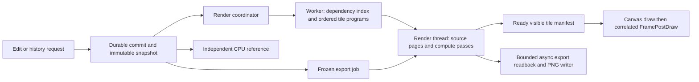

# Phase 1.1 renderer redesign

## 1. Decision and scope

Move connected terrain rendering onto a bounded GPU tile pipeline using Godot's main RenderingDevice. Use it for both interactive display and frozen export. Keep the normalized document, durable command/history model, and CPU reference renderer authoritative. Replace the synchronous CPU rasterize-and-upload path in `MapCanvas.ShowCommittedChange` with asynchronous, revision-aware preparation, GPU evaluation, and atomic publication of the visible tile set.

User direction (2026-09-23): offload as much work as practical to the GPU. Accordingly, source resampling, dab/shape coverage, pigment composition, river coverage and final compositing belong on the GPU; export reuses those kernels. CPU responsibilities are durable state, input/recipe preparation, bounded file decoding and transfers, scheduling, PNG compression/publication, and the independent reference. Further GPU binning or compaction is justified by profiling after the ordered pipeline works, rather than transferring these responsibilities back into per-pixel CPU loops.

This is a proposed architecture with a mandatory feasibility gate, not a claim that GPU execution will meet the budget. Implement the smallest real-map path through durable commit, tile reconstruction, GPU output and correlated canvas presentation first. Proceed to the full renderer only after that path passes the stated correctness and latency gates on the pinned machine.

This document adds a redesign to the blocked Phase 1.1 work. It does not replace completed Plans 01–04, mark Plan 05 complete, change format 3, change any numeric acceptance threshold, or introduce an engine migration. Convert the work packages below into executable GSD plans after adversarial review. The current request covers architecture and review; this document itself authorizes no implementation run.

## 2. Evidence and diagnosis

| Evidence | Observed result | Architectural implication |
|---|---|---|
| Original Phase 1 hardware record, `artifacts/phase1-acceptance/hardware.json` | All 12 rows passed on its older pixel-space workload | Retain as historical evidence; brush coverage and workload are not equivalent to normalized geometry |
| Phase 1.1 full record, `artifacts/phase11-acceptance/hardware.json`, SHA-256 `4b0ffcb88913f2b85561e8f8a8e965f31cc86cb50ac4d1339b52ec96dfa41152` | Input-to-visible p95 64.84–1384.61 ms; all 12 rows failed; frame and resource gates passed | Rendering dominates; a frame-rate pass does not establish interaction latency |
| Stage breakdown of that full run | Maximum reference-render stage roughly 948–1376 ms for painting, versus single-digit ms for most durable commits | Move raster work off the UI thread and remove repeated source processing |
| Commit `0c206a2` | Removed unused priming, reused prepared flattened inputs, bounded sampled-tile cache, skipped saturated dab work | Useful retained optimizations, insufficient to close acceptance |
| Post-fix sustained smoke, summarized in `01.1-05-SUMMARY.md` | Evicted paint: 60.014 s, 15 correlations, p95 211.68 ms; max render 203.10 ms | Correct cold reconstruction must accelerate too; warm caches alone cannot close the gap |
| Existing production call path | `MapCanvas.ShowCommittedChange` synchronously primes, runs `Parallel.For`, creates byte arrays, and uploads each changed `ImageTexture` | Parallel CPU loops still block the caller and replay work proportional to history |
| Existing hardware workload | `ConnectedAcceptance` creates legacy `PaintStroke` bursts of 60 samples and waits up to four seconds between edits | Preserve this regression matrix, but also validate current UI `TexturePaintStroke`/Land/river behavior and an independently clocked load |

Short smoke readings are diagnostic and must not substitute for full acceptance. The post-fix smoke artifact is not an immutable formal baseline; preserve a copy with a manifest before additional measurements. A 96-unit diameter in the product examples and the legacy harness's **96-unit radius** are distinct workloads: retain the existing harder radius workload and add the diameter example; never silently halve it to obtain a pass.

Code anchors: `Scripts/Rendering/ConnectedTerrainGraph.cs` (`PrimeViewportInputs`, `EvaluateNormalizedRegion`, `PrimeAccumulator`, `ApplyLegacyStrokeToTile`, `RenderReferenceCore`); `Scripts/App/MapCanvas.cs` (`ShowCommittedChange`, `OnEditCommitted`, gesture commit); `Scripts/Acceptance/ConnectedAcceptance.cs` (`RunScenarioAsync`, `PresentRevisionAsync`, `BurstSamples`, `DelayBurstAsync`).

## 3. Contracts retained

- Map geometry remains double-precision CPU data, top-left origin, 1,000-unit longest edge. Editing and export dimensions remain independent samplings. Screen handles keep pixel units.
- A command is persisted and acknowledged before dependent GPU pixels are **published**. Private preparation of a projected revision may overlap its durable commit, but an exact command/revision/history match gates publication; failed or superseded commits discard the candidate. GPU memory and derived caches never become recovery sources. Existing gesture undo units and redo behavior remain intact.
- Background/Foreground order, texture pigment, Foreground land coverage, river subtraction, and whole-layer opacity stay separate operations. Land evaluates before the river modifier. Imported replay cutoffs and source placement remain effective.
- Input-to-visible p95 ≤50 ms and p99 ≤100 ms; frame intervals p95 ≤20 ms and p99 ≤33.3 ms at 1920×1080; recent resident undo p95 ≤100 ms for ≤16 tiles. Every mandatory scenario/cache row runs ≥60 s with ≥15 complete correlations. Stalls and failures remain in the distribution.
- Tiled/whole and GPU/CPU reference comparisons allow ≤1 channel value in final 8-bit RGBA, with no boundary-correlated artifacts. Transparent hidden RGB, premultiplied compositing, soft coverage and source sampling get explicit cases. The unstyled-coast decision remains; no distance field is added.
- Existing measured resource ceilings, cancellation, atomic PNG publication and fresh-process device-loss recovery remain gates. Slow but correct CPU fallback is a recovery mode, not evidence of GPU performance acceptance.

## 4. Proposed data flow and ownership

| Component | Responsibility and boundary | Proposed home |
|---|---|---|
| Render coordinator | Accept acknowledged snapshots; assign generation/device epoch; collect work and publish one visible manifest; report failures and backlog | `Scripts/Rendering/ConnectedRenderCoordinator.cs` |
| Tile program compiler | Immutable data only: map transforms, ordered operations, replay cutoff, intersecting sample ranges, source dependencies; no Godot calls | `src/Mapwright.Application/Rendering/TerrainTileProgram.cs` and `TerrainTileProgramCompiler.cs` |
| Source page provider | Resolve verified immutable blobs/prepared display data, decode native source pages in bounded workers, upload pages plus sampling support; GPU performs placement/resampling | `Scripts/Rendering/TerrainSourcePageProvider.cs` |
| GPU tile renderer | Own global-device RIDs, command recording, shaders, barriers and safe retirement on the render thread | `Scripts/Rendering/ConnectedGpuTerrainRenderer.cs`, `Shaders/connected_terrain_*.glsl` |
| Tile store | Bounded content-addressed derived tiles, resident generations, optional disposable checkpoints; no durable authority | `Scripts/Rendering/TerrainTileStore.cs` |
| Canvas adapter | Draw published texture handles; retain pan/zoom/cues; no synchronous terrain evaluation/upload loop in edit callback | `Scripts/App/MapCanvas.cs` |
| Reference/export | Independent CPU pixel oracle; frozen export uses GPU kernels with bounded asynchronous readback into the existing PNG/publication pipeline | Existing `ConnectedTerrainGraph.cs`, `DocumentPngExport.cs`; new `GpuFrozenTerrainExport.cs` |

These are proposed files, not existing APIs. The application layer stays engine-independent. `GlobalGpuBrushSurface` demonstrates main-device texture sharing and render-thread dispatch only: its single-dab shader, callback timing and disposal order are not production correctness guarantees. `GpuExportTileRenderer` uses a local device plus synchronous readback and is not the interactive template.

## 5. Tile evaluation and deterministic composition

**Tile identity.** Start with existing 256×256 interior tiles, including smaller edge tiles. Keys include project/map identity, canonical snapshot content identity and history branch, map bounds, sampling dimensions/LOD, tile origin, immutable source hashes/placements, replay cutoff, renderer semantics version and device epoch where applicable. Revision number alone is insufficient after undo followed by a new edit. Tile intersection lists are disposable accelerators; rebuilding them from the snapshot must give identical order and pixels.

**Canonical compatibility order.** Preserve the existing direct CPU oracle rather than infer journal chronology: within each terrain role, evaluate the legacy texture `Strokes` array in stored order, then the resolved `TextureStrokes` array in stored order. Foreground Land strokes form a separate ordered coverage stage, followed by the river modifier; layer opacity and Background/Foreground composition follow. The snapshot does not store a unified chronology across the two texture arrays. A chronological blend-order change would require a separate behavior/version decision. Appending a legacy stroke when resolved strokes already exist invalidates the resolved stage and all dependent composition: it cannot simply overpaint the resident final result. Test both commit interleavings against the current oracle.

**Typed tile programs.** CPU workers bin conservative map-space bounds, retaining array order, source-order ties, and old/new river bounds. Texture programs filter discrete dabs without reordering survivors and carry union coverage across chunks. Land programs bin consecutive **segment indices**, keep both endpoint records, evaluate the closest point on each segment, and carry the **maximum** footprint coverage across segments/chunks; apply Add/Subtract once per completed stroke. A one-sample Land stroke is one footprint. River programs preserve the current `GeometrySegments()` endpoints and width interpolation at the clamped projection, take maximum segment coverage including bank softness, and subtract once from post-Land coverage. Chunks cannot omit a connecting segment. Add a two-outside-endpoints segment crossing a tile, a segment crossing a chunk boundary, overlapping soft Land segments (0.5 maximum remains 0.5), and ordered Add/Subtract fixtures. Carry every persisted recipe field, but preserve the oracle's current round-falloff/hash-colour resolved-texture behavior; this performance redesign does not silently implement different tip/roughness/jitter behavior merely because those fields exist in the recipe.

**GPU algorithm.** Use one invocation per output pixel for each operation stage, with 8×8 workgroups initially. For a texture stroke, iterate its intersecting dabs in persisted order to compute coverage, then apply the stroke opacity/flow and composite pigment exactly as the CPU oracle does. Do not replace this with one colour composite per dab: those operations are not equivalent. Use pixel-owned writes rather than unordered floating-point atomics. Dispatch the canonical compatibility stages above with required memory dependencies. Chunk long sample/operation lists into bounded dispatches while carrying each typed reducer's partial state; chunking must be numerically equivalent within the declared tolerance.

**Layer state.** Keep Background pigment, Foreground pigment, Foreground land coverage, and river subtraction distinct. Compose visibility and layer opacity at the final stage. A river edit re-evaluates the affected modifier/composite region rather than repainting unchanged pigment. A layer-opacity edit invalidates composition, not terrain coverage. Preserve the legacy no-base-coverage behavior only for documents/strokes for which the current reference applies it; test mixed legacy/resolved history explicitly.

**Precision.** Proposed initial intermediates: RGBA32F premultiplied linear pigment and R32F coverage, final RGBA8 display. Source colour decode, bilinear interpolation, intermediate quantization and final nearest-even encoding must match the existing CPU path's observable semantics. In particular, the current placed-source path quantizes sampled source colour to RGBA8 before later composition; avoid silently removing that boundary. Map-to-sample conversion derives from global pixel centres and map bounds, never tile-local UVs. CPU doubles remain authoritative; tile-relative GPU floats are an optimization whose 1K/4K/16K edge accuracy must be measured. FP16 is deferred until separately proven.

Plain FP32 is not sufficient evidence for hard-edge parity: a double distance just outside a hard boundary can round onto it and change alpha by 255. R1 therefore includes texture, edged/round Land, river and placed-source boundary microkernels at immediately adjacent representable coordinates, with zero/one hardness or softness and 1K/4K/16K sampling. It must select and prove a precision strategy before R2: a supported higher-precision GPU path, or CPU-computed conservative ambiguity regions with exact reference corrections uploaded before publication. The latter may evaluate bounded exceptional pixels on CPU but may not require interactive GPU readback; all correction work and transfers count in latency and memory. If ambiguity cannot be bounded or higher precision misses the budget, R1 fails. Preserve the current validators' accepted coordinate/recipe domain; do not narrow it, antialias exact edges, or relax the channel tolerance to make FP32 pass.

**Appending and rebuilding.** A resident exact predecessor can apply only an appended eligible operation. Any branch change, incompatible source/placement/LOD, layer-order change or history gap reconstructs from a compatible checkpoint or immutable source plus ordered operations. Checkpoints are optional, checksummed, versioned and disposable; the mandatory evicted path must succeed without them. The feasibility test must replay the final 15-stroke state and longer histories, not only a single dab.

## 6. Source preparation, cache eviction and export

Use the existing verified prepared full-map display source only when its source identity, full-map placement, dimensions and sampling semantics match the requested viewport. Positioned/recovered sources use explicit transforms and bounded source pages; no stretch-to-canvas fallback. Page descriptors include native source origin/dimensions and bilinear support: fetch neighboring texels across page boundaries, clamp only at the full source raster boundary, and preserve transparency outside placed bounds plus pre-composition RGBA8 quantization. A sample footprint spanning multiple pages must match the unpaged source; add explicit page-border fixtures. Treat a missing or corrupt derived source as reconstructible from preserved source data, with a reported slow path. Hashing a derived file proves its bytes, not that it belongs to the requested source recipe: include provenance/recipe identity in its descriptor and key.

No whole-document allocation proportional to 16K² belongs in the interactive renderer. Source decoding workers have a shared byte reservation and concurrency limit. Existing formats that require a full native raster decode must be admitted conservatively before decode; if the envelope cannot hold it, fail the operation explicitly until a bounded decoder exists. Do not represent that limitation as solved by GPU tiling.

Define cache states in executable assertions. Warm retains verified decoded sources, tile programs, GPU source pages and rendered tile state. Cold starts with none of those derived items before the first measured edit. Keep two explicitly named eviction workloads: **inherited dirty-region eviction**, matching the current harness (including retained unchanged canvas tiles), and **strict visible-set reconstruction**, which removes reusable decoded/program/source/render state plus optional tile/history checkpoints for every measured edit. The strict mode retains the old front manifest only as a **display-only lease**, charged to GPU memory: it may be drawn while the new generation is rebuilt, but cannot be sampled, copied, or supply unchanged handles to the new manifest. Reconstruct every tile in the declared visible set from preserved sources, then safely retire the lease. This exception is disposable display state, never authoritative data.

For inherited timing, keep the existing clock before durable commit and subsequent eviction inside that clock. The strict workload uses the same clock boundary and includes eviction, required retirement waits and reconstruction; only the leased front remains until replacement. Record surviving resources, front bytes, rebuilt tile counts, forbidden-reuse checks and eventual retirement. Authoritative snapshots/journal/blobs, immutable import-time prepared source files and engine/kernel infrastructure remain; enumerate those separately from source pages/accumulators. Distinguish OS filesystem caches from application caches. No hidden pre-rebuild may occur before the timer.

Initially retain `DocumentPngExport` on its existing frozen CPU evaluator while R1 proves the interactive path. R4b then routes production export through the same GPU tile programs and kernels at the requested output sampling. Viewport tiles never become export source. The frozen job owns snapshot, source/recipe hashes and an export identity separate from visible generations; edits, undo and LOD changes cannot retarget it. CPU remains an independent pixel oracle and explicit recovery fallback.

Export uses the main-device scheduler at lower priority than visible edits. Admit bounded tile batches and at most two readbacks initially; use the pinned engine's asynchronous readback only after testing its callback thread, buffer ownership, completion and cancellation behavior. Assemble PNG rows/bands in bounded CPU buffers with backpressure from the encoder, accounting for out-of-order completion. Do not retain a full 16K frame or dispatch a document-sized kernel. A cancelled export stops new dispatches, retires already-submitted resources safely, ignores late callbacks by job identity, and deletes only its own temporary output after outstanding file users release it. Device loss leaves the previous destination intact. Full 1K/4K/16K, seam, cancellation and atomic-publication checks cover the GPU route, with the CPU route retained for differential verification.

Job priority alone cannot preempt submitted GPU work. Begin with a measured submission quantum targeting ≤1 ms render-thread recording/upload work per frame and ≤2 ms outstanding export GPU work, both provisional ceilings to validate in R1/R4b. Bound pixel regions and sample/operation chunks together; a tile count is not a work bound for long histories. Yield and reconsider interactive work before each next chunk, calibrate conservative cost estimates on the pinned hardware, and reduce/stop export admission when estimates or measured chunk times exceed the quantum. Reserve memory/staging/scratch capacity for one supported incoming interactive generation; if it cannot be reserved alongside export, pause export. Export may make no progress during sustained editing. Test an edit arriving immediately after the largest admitted export chunk with dense history and slow PNG consumption, and require the unchanged total latency/frame gates.

## 7. Scheduling, durable acknowledgement and presentation

1. From the current immutable acknowledged state, apply the queued command privately to obtain a projected revision and identity. Start the existing `FULL`-synchronous durable transaction. Only one projected edit per project may be paired with the corresponding queued commit; undo, branch replacement, failure or cancellation invalidates the candidate. The production integration should prepare `DocumentChange` once inside `EditSession`, then share that immutable result with the private renderer while the repository commit proceeds; the tracer's duplicate `Apply` is only a bounded experiment.
2. In parallel, the coordinator captures projected dependency hashes, visible tile set and generation. Workers prepare source pages and tile programs off the UI thread. The measured strict path starts its source read/SHA validation after input and never borrows pixels or handles from the display-only front. Cancellation checks occur between bounded units of work.
3. One render-thread owner records main-device uploads and compute work. Bound command bytes, operations per dispatch, active scratch lanes and queued generations before recording. Do not call local-device `Submit`/`Sync` or read pixels back in the interactive path.
4. Build a private pending visible-tile manifest. Unchanged tiles may be reused only when dependency identity proves their pixels valid for the target revision; strict reconstruction permits no such reuse. Match the durable acknowledgement to the projected command, revision, branch and ordered operation history before passing any candidate to the canvas. Changed tiles publish together so the canvas cannot display a half-old/half-new edit as the new revision. The previous valid manifest remains visible while work is pending.
5. Publish the generation only after the pinned Godot scheduling/barrier proof establishes that its compute writes precede the draw that samples it. A render-thread callback announcing dispatch is not GPU completion or visible presentation.
6. `_Draw` records the actual manifest/generation used. The following correlated `FramePostDraw` is the current acceptance endpoint; report that display scanout is excluded. Tests must prove the manifest contains the relevant operations, and stale callbacks cannot satisfy newer requests. Validation-only GPU readback/sentinel tests verify pixel completion separately from timed runs.

Use at most two staged generations initially: one in flight and one pending latest snapshot, with immutable front handles retained until safe retirement. Superseding work may skip evaluation of intermediate snapshots but must retain all acknowledged commands in the target snapshot and preserve explicit sequence accounting. Undo/redo invalidates simple 'contains every earlier sequence' assumptions: record presented, superseded-before-presentation, undone-before-presentation, failed and cancelled outcomes separately. Strict inherited acceptance rows require every measured operation to reach its correct visible state; run them without supersession. Under independent load, missing/cancelled/unpresented sequences are reported and cannot vanish from latency denominators.

The redesign does not **display** optimistic, unpersisted terrain pixels. Speculative GPU work is private and disposable, never an acknowledgement or recovery source. Current transient cursor/gesture cues remain distinct from acknowledged terrain. The inherited harness starts its edit-to-visible clock immediately before `ExecuteAsync`; retain that metric and label it honestly. A separate pointer trace records event time, gesture completion, commit start/end and visible result so gesture batching cannot conceal wait time. If the product requires each in-progress pointer sample to become durable terrain within 50 ms, that requires a separate grouped microcommit design; the GPU plan alone must not claim that guarantee. Resolve this distinction against the product contract in R0 and record both traces; do not quietly redefine the inherited threshold.

Provisional engineering allocation, not a promised percentile decomposition: durable commit 15 ms, preparation 3 ms, queue 3 ms, GPU work 8 ms, draw scheduling 17 ms = 46 ms. Measure total latency directly; individual p95 values do not add into an end-to-end p95. A storage floor above budget or a global-device scheduling delay is a failed feasibility result, not grounds to subtract that time from measurement.

## 8. Resource ownership and recovery

Replace check-only concurrent admission with a shared reservation/release ledger covering CPU decoded and staging bytes, GPU source/terrain/display/scratch resources, pending generations, history acceleration, and export buffers. Multiple individually admissible parallel allocations may exceed the total; reserve atomically before allocation and release only on actual retirement. Count driver-visible allocations separately from tracked requested bytes and retain process-peak measurements.

Illustrative slot calculation at 256²: Background+Foreground RGBA32F (32 B/pixel), land+river R32F (8), front/back RGBA8 display (8) total 48 B/pixel = 3 MiB before overhead. Two full sets of 256 slots for a 4K square consume 1.5 GiB; four scratch lanes at 36 B/pixel add 9 MiB. This is a conservative planning estimate, not admission: source pages, indices, descriptor/pipeline overhead, history, staging, engine headroom and retired-but-live generations must also fit. Prefer visible tiles plus bounded prefetch; never assume all editing tiles must stay resident.

Retain `RenderResourceLedger` limits: GPU ≤min(25% of reported VRAM, 4 GiB) minus recorded engine/compositor headroom; decoded CPU ≤512 MiB; export buffer ≤512 MiB; process ≤25% of system RAM; history acceleration ≤4 GiB. Reject negative/overflowing counts and over-limit source/operation payloads before GPU allocation. Do not allocate an unbounded stroke-by-tile buffer. Backpressure affects scheduling, not durable command loss.

All RenderingDevice resource creation, mutation and destruction belongs to one render-thread owner. Use an explicit device epoch and lifecycle states for pending, visible, retired and disposed resources. The pinned-engine spike must establish the safe retirement mechanism; an arbitrary number of elapsed frames is not a fence. Release display wrappers before their underlying texture only after no queued draw can reference them. Test close/reopen while initialization, upload, compute or publication is queued. Device loss can terminate the process on the current platform: fresh-process journal recovery remains the supported path, without post-loss readback or saving assumptions.

## 9. Delivery sequence and exit gates

| Package | Dependencies and owned scope | Concrete deliverable | Exit condition |
|---|---|---|---|
| R0 — evidence and workload contract | First; acceptance runner, `ScopeCuesSmoke`, `AcceptanceContracts`, new run context | Unique run root propagated through every case; manifest for code/shaders/fixture/captures; immutable failed-run archive; exact timestamp/cache definitions and bounded workload vectors | Negative tests reject root escape, prior-run mutation, source/shader mismatch, missing sequences and a dispatch-only endpoint. Preserve old Phase 1 mismatch disclosure; a later recreation counts as recovery only if bytes match original hashes |
| R1 — end-to-end feasibility tracer | R0; minimal coordinator/GPU renderer, proof shaders including precision microkernels, MapCanvas adapter behind internal switch, acceptance case | Pinned real-map flattened source; actual durable legacy 60-sample stroke plus a current resolved texture stroke with visible Land coverage; canonical replay of 15 strokes; main-device output drawn with correlated generation; hard-edge/source-boundary precision strategy proven against CPU | ≥60 s warm/cold/inherited-evicted/strict-reconstruction paint rows with ≥15 complete samples pass unchanged total/frame/resource gates and ≤1-channel pixels. Include cold initialization and precision correction costs in their declared endpoint. Reject candidate on repeated failure before building all tools |
| R2 — canonical tile programs and source pages | R1; application compiler/provider and pure contracts | Both terrain roles, transformed sources, canonical legacy/resolved stages, typed Land/river segment reducers, source replay cutoff, deterministic bins/chunks and page support | CPU replay of compiled programs matches independent direct reference, including non-square map, corners, same-order ties, both mixed-history interleavings, branch replacement, crossing segments/chunks and source-page borders |
| R3 — complete GPU terrain and bounded store | R2; renderer, tile store, shaders, resource ledger | Linear pigment/coverage/modifier/composite stages; resource reservations; append/rebuild/checkpoint paths; no CPU pixel readback for display | GPU-reference fixtures pass across 1K/4K sampling, tiles/whole, soft alpha, layer opacity, moved river, legacy/resolved mixed histories; eviction reconstructs same pixels; concurrent admission and retirement stress stay within caps |
| R4 — app/history integration | R3; MapCanvas, coordinator, relevant edit/history adapters | Asynchronous generation publication, view/LOD changes, visibility/opacity and all current tool edits; stable cues; bounded queues; current undo/redo semantics | Race tests cover late old results, close/reopen, undo plus new branch, pan during rebuild, layer change during queued stroke and device epoch change. Every published manifest matches one acknowledged state; no half-published revision |
| R4b — GPU export and shared scheduling | R3; `GpuFrozenTerrainExport.cs`, `DocumentPngExport.cs`, GPU scheduler and export acceptance | Frozen target-resolution evaluation with shared kernels, lower-priority bounded dispatch, async readback, PNG backpressure and cancellation-safe resource retirement | GPU/CPU pixels and 1K/4K/16K anchors agree; real 16K export stays within caps; continuing edits cannot change output revision; cancellation/device loss preserve prior destination; concurrent export does not starve interaction |
| R5 — full physical and export acceptance | R4 and R4b; connected cases, runner/verifier and report | Both original 12-row regression matrix and independently clocked load; modern UI operations; fresh visuals; real GPU 16K export; cancellation/crash/resource evidence | SelfTest, fresh Full and VerifyReport pass with current source/shader hashes; all unresolved sequence outcomes and stalls counted. Independent phase verifier confirms Plan 05 and DOC-01 only after evidence is complete |

R1 is a production-shaped tracer with removable internal selection, not a synthetic GPU throughput demo. Its CPU correctness reference and failure reporting ship into later packages. If it fails, retain measurements and revise this architecture; do not spend R2–R5 assuming the GPU makes reconstruction cheap. No date estimate is asserted before R1.

Existing runnable checks: `./Scripts/run-phase11-acceptance.ps1 -SelfTest`, `./Scripts/run-connected-phase1.ps1 -Case RenderReference`, `./Scripts/run-connected-phase1.ps1 -Case MapUnits`, and the final `-Full`/`-VerifyReport` pair. New cases such as `GpuTerrainParity`, `GpuTerrainScheduling`, `RenderResourceReservations` and `GpuTerrainLatency` are proposed deliverables; register and prove unknown-case failure before referencing them as executable gates. Keep long hardware tests out of parallel test runs that could contaminate timing.

## 10. Validation matrix and falsification

| Risk | Required counterexample/test |
|---|---|
| GPU blending changes stroke semantics | Overlapping translucent dabs; stroke opacity applied once; two strokes with same geometry but different colour/order; mixed legacy/resolved behavior |
| Reconstructed state depends on caches | Delete all derived files and evict CPU/GPU state; reopen and compare warm/cold/evicted pixels; corrupt a checkpoint/source page; verify preserved source hashes |
| Fast path serves wrong geometry | Positioned and anisotropic imported rasters, non-square map, 96-unit diameter and existing 96-radius workloads, 1K/4K editing, 16K export anchors |
| Spatial bins or chunking drop contributions | Tile corners, subpixel radii, long strokes split across chunks, zero-intersection lists, changed old/new river bounds; compare against direct unbinned reference |
| Async callbacks acknowledge wrong pixels | Deliberately delay/reorder preparation and callbacks; newer edit, undo or closed project wins; sentinel readback proves sampled generation outside timed run |
| Timing is hidden by batching/coalescing | Independent monotonic event producer, timestamps from generation through gesture/commit/presentation, queue age/depth, every outcome reconciled, last pending operation drained and included |
| One fixture flatters the renderer | Legacy regression and actual UI Texture/Land/River scenarios on flat and editable recovered imports; dense-overlap and long-history fixtures (15, 100 and 1,000 strokes) report reconstruction scaling, even when larger cases miss latency |
| Memory looks bounded one allocation at a time | Concurrent source upload, second generation, history restore and export; simulated low headroom; failed partial allocation; repeated open/close and stale callback reclamation |
| Historical evidence overwritten again | Hash prior artifact roots before/after each run; inject a case targeting the old shared path and require rejection before the write |
| GPU optimizations leak into export authority | Freeze revision N, continue editing to N+1 during 16K export, cancel/fail at multiple publication stages; output remains N and prior destination survives failures |

The 15-stroke mandated workload is a concrete feasibility bound, not a promise of ≤50 ms reconstruction after deleting every cache for unbounded history. Record scaling and progress for larger histories. If an additional supported workload is required to meet the same latency bound, add it explicitly before implementation acceptance; no hidden size or history truncation is permitted. Pin the window and raster dimensions separately in R0: retain the inherited 1920×1080 window with its initial 896-pixel display limit, and name additional 1K/4K/high-zoom rasters explicitly. Modern resolved-only Foreground tests must establish visible coverage first and verify changed pixels; keep a separate no-coverage case to confirm invisible pigment behavior, not as the performance proof.

## Review revision record

The first adversarial review returned READY WITH CONDITIONS (C1–C5). This revision makes canonical legacy/resolved stage order and append eligibility explicit; specifies Land/river segment reducers; separates strict reconstruction from a display-only front lease; brings hard-edge precision into R1 with a gated fallback; and bounds GPU submission quanta with reserved interactive capacity. It also clarifies source-page support, actual raster dimensions, visible modern-tool fixtures and preservation of current resolved-texture behavior. The independent focused recheck returned **READY for executable planning**, resolving C1–C5 with no new architectural contradictions. `01.1-RENDERER-REDESIGN-REVIEW.md` retains the original failure traces and resolution table. Measured GPU feasibility remains pending; R0/R1 are mandatory gates, and Phase 1.1 remains incomplete.

## 11. Alternatives and rollback

| Alternative | Assessment |
|---|---|
| More CPU cache/loop tuning only | Retain measured improvements, but the 211.68 ms evicted row leaves a material reconstruction gap. Could win if R1 disproves GPU viability; requires its own measured algorithmic improvement |
| Worker-thread CPU rendering only | Reduces UI blocking but does not remove input-to-visible work; useful preparation infrastructure, insufficient as the main latency strategy |
| Lower viewport sampling or change brush size | Changes visual/workload contract; excluded from this proposal |
| GPU tiles on Godot main device | Chosen candidate: existing sharing prototype, pixel-parallel reconstruction, no interactive CPU upload/readback round trip; scheduling and correctness remain proof gates |
| Local device plus per-edit readback | Adds synchronization/readback and cannot directly reuse the current main-device display path; excluded from interactive design |
| Rust/wgpu or journal/schema redesign | A measured `FULL` fsync tail now justifies a separate investigation, but no replacement has passed crash recovery or replay/branch proof. Keep the current durable format until such a gate is met |

Introduce an internal `CpuReference`/`GpuTiles` selector for controlled comparison, covering both viewport and export. Keep CPU mode available for inspection and recovery; label degraded performance. Enable GPU by default only after R5. Renderer/checkpoint version changes invalidate disposable caches, not document format or source blobs. Rollback selects CPU mode and discards derived GPU state after safe retirement. No project migration is part of this plan.

## 12. Review questions and sources

The adversarial reviewer should attempt to disprove: (1) that cold/evicted reconstruction plus durable commit can fit 50 ms; (2) that main-device ordering establishes the measured endpoint; (3) that chunked float math can match the double CPU oracle; (4) that cache/sequence accounting cannot hide the slow path; and (5) that resources are bounded during concurrent generations and export. Report blockers with a concrete failure trace and a proposed correction, separating evidence from speculation.

## Implementation gate update — 2026-09-23

R0 is implemented in Plan 06: new Phase 01.1 runs have unique roots and a source/shader/artifact hash manifest, with run-specific visual review and fail-closed correlation checks. The old Phase 1 visual hash mismatch remains disclosed; this does not repair or rebaseline those five captures.

Plan 07 built an opt-in real-map global-device tracer. Fifteen acknowledged 60-sample legacy strokes reached revision/generation-correlated canvas draws over 63.154 seconds at 827×896. The final GPU frame had 257,565 changed pixels and zero channels more than one value away from the independent CPU reference. Warm revisions 2–15 presented in 16.571–16.803 ms, but the first generation took 57.825 ms, making the mixed-run p95 57.825 ms; two other first-generation probes took 55.806 and 68.689 ms. The first input timestamp excluded flattened-base preparation and device source/shader initialization, so even these misses are **not** full cold-state results. See `01.1-07-SUMMARY.md` and its preserved raw trial paths.

R1 is halted, not passed. The source/reference parity proof is narrow: modern resolved pigment with Land coverage, true cold/inherited-evicted/strict reconstruction, hard-edge precision across 1K/4K/16K and safe retirement remain open. Do not implement R2–R5 or promote Plan 05/DOC-01 from this evidence. The next design iteration must first find and measure the first-generation and strict-reconstruction floor without moving required work outside the clock, then repeat R1's full gate. The CPU renderer remains the production default.

Plan 08 then measured strict full-visible-set reconstruction with every edit clocked before durable commit, SHA-verified immutable source read, GPU source upload and complete replay. A fresh-kernel 60.084-second/15-sequence run had p95 172.136 ms. A fairer shared-kernel 60.039-second/15-sequence run retained only shader/pipeline infrastructure, no source or rendered pixels, and had p95 158.373 ms against the unchanged 50 ms threshold. The latter's frame p95 was 16.966 ms and GPU/CPU parity at revisions 1, 8 and 15 had zero channels differing by more than one. Four shared-kernel durable commits took roughly 97–137 ms, and one GPU replay took 35.87 ms (50.493 ms total), so neither precompilation nor GPU rasterization alone resolves the end-to-end floor. Both raw trial paths and stage data are recorded in `01.1-08-SUMMARY.md`.

This was the mandatory R1 rejection point for the serial candidate. The revised proof below keeps those failures in the record. No durability semantics, journal/schema design, threshold or workload has been changed.

## Revised feasibility path — durable commit plus strict replay

The first stage profile identified two independent tails: SQLite's `FULL` transaction commit reached 78.33 and 44.27 ms in one 15-edit run, while another revision spent 36.285 ms in GPU replay with a fast commit. Neither may be removed from the input-to-visible denominator. Keep SQLite as the durable authority; changing to `NORMAL`, acknowledging before fsync or trusting a GPU cache would be a different durability contract and is not an optimization here.

The legacy strict tracer now records all ordered strokes into one GPU compute list with explicit barriers and two alternating scratch images. It allocates scratch images without a CPU zero upload because each dispatch writes the entire output. A fresh candidate rereads and SHA-verifies the immutable source after each input, uploads it, and reconstructs every stroke; the preceding front is display-only. The edit command's projected immutable state may be rendered privately while the existing SQLite commit runs. Presentation waits for the exact durable command, revision and ordered stroke history, so a commit failure has no visible terrain pixels. The initial imported revision is displayed before timed edits, matching the editor's starting state; it is never sampled or copied into a candidate. This baseline setup is declared separately from cold shader/device initialization and does not supply measured reconstruction pixels.

Two ≥60-second, 15-edit real-map trials of this revised legacy path passed: `artifacts/gpu-terrain-strict/trial-a8e36ed85c8847deb237b54ad92762ca/gpu-terrain-strict.json` (p50 33.6644 ms, p95/p99 48.8243 ms, frame p95 16.9501 ms) and `artifacts/gpu-terrain-strict/trial-4de9b78ba977401f86132be65dfee615/gpu-terrain-strict.json` (p50 33.5656 ms, p95/p99 48.8427 ms, frame p95 16.9118 ms). A third independent ≥60-second, 15-edit run **failed** at p95 56.5693 ms: `artifacts/gpu-terrain-strict/trial-e97287655eba4923bff2fd1636006975/gpu-terrain-strict.json`. Its first edit took 56.5693 ms, with about 27.6 ms to durable acknowledgement and 40.9 ms to `_Draw`; the remaining 14 edits took roughly 33–35 ms. SQLite transaction commit stayed below 4 ms in that run, so this failure is first-edit scheduling, not an fsync spike. All three had zero missing edits and sentinel parity within one channel value. They used the unchanged `FULL` transaction and unchanged 50/100 ms gate. The 79-case phase self-test and 66-assertion reference-render connected case also passed. The revised path has **not** passed a reliable R1 gate; do not enable it in production or advance R2–R5. Earlier profiled failures remain raw evidence, including a 78 ms fsync tail that could recur. Measure and address first-edit preparation/presentation without moving required work outside the clock; independently prove durable failure/discard, branch races, modern resolved pigment/Land, precision, export, memory ownership and retirement. If repeated fsync stalls defeat p95, design and crash-test a replacement primary durable protocol as a separate gated project; do not silently relax the commit acknowledgement point.

The three trials above started their clock before generating synthetic fixture samples, unlike the original `GpuTerrainTracer` case, which starts immediately before `ExecuteAsync` after the stroke command exists. The strict harness now uses that inherited boundary **before** private `command.Apply`, durable commit, source verification and GPU reconstruction; historical broader-clock data remains unchanged. At the aligned boundary, `artifacts/gpu-terrain-strict/trial-7ec4e5f0b49f40b2a768f324f6a98890/gpu-terrain-strict.json` still failed p95 at 52.4144 ms on first-edit private projection and scheduling. An experiment that launched the transaction and two independent `Apply` calls simultaneously made that first edit worse (58.4018 ms, `artifacts/gpu-terrain-strict/trial-a63043f202054456842ba977bb0d20c3/gpu-terrain-strict.json`); it was reverted. The next production design should share one `DocumentChange` from `EditSession` with the renderer before repository commit completes, rather than duplicate its first-use work. These failures preserve the R1 halt.

**Shared projection and frame alignment (2026-09-24).** With single-threaded rendering, a strict edit that starts in frame F can draw no earlier than F+1. It presents at ~33 ms if durable acknowledgement and GPU recording finish before F+1's process step, and slips to ~50 ms otherwise. `EditSession.ExecuteAsync` now shares its single `Apply` result as a `PreparedEdit` before the repository commit (the design in step 1 of section 7), and the harness no longer calls `Apply` twice. The repository prepares command JSON metadata when constructed. When a session binds, `MapCanvas` rehearses discarded, never-committed tool commands: pure `Apply` and payload serialization only, with no pixels, textures or rows, and the cost is reported as setup. Aligned-clock trials then passed twice at p95 34.1 ms with every edit, including the first, at 33–34 ms. A third run failed at p95 149.8 ms on two `FULL` commit tails (79.8/45.8 ms) plus ~40 ms connection-close delivery. Each commit uses a fresh `Pooling=false` WAL connection, and closing it checkpoints and deletes the WAL. A diagnostic idle connection that keeps the WAL open gave 45/45 commits at ≤4.8 ms across three runs (two passes). The third run failed at p95 50.1 ms because the first acknowledgement came at 17.6 ms, about 1 ms past the frame boundary. The next change is a repository-owned write connection that retains the WAL and removes per-edit open/close. The acknowledgement point is unchanged. It needs StorageCrashWorker crash and reopen proof before production. R1 remains halted until repeated trials pass reliably. See `.planning/debug/phase11-durable-replay-latency.md`.

## Implementation outcome — 2026-09-24

R1 through R5 are implemented and physically verified; see `01.1-09-SUMMARY.md`. The delivered design differs from the plan above in three deliberate ways:

- **Precision.** Following user direction to target high-end hardware, the GPU evaluates every stage in IEEE double precision (`precise`, no FMA contraction) instead of float with ambiguity corrections. That includes fp64 `atan2`/`cos` for edged Land polygons. `GpuTerrainParity` finds zero channels over one across 45 fixtures, and placed/flattened canvases are byte-identical to the CPU oracle.
- **Evaluation shape.** Each acknowledged revision re-evaluates the whole visible canvas in one compose dispatch, after a cached per-source sampling pass. It does not use appended tile programs or checkpoints. Warm, cold and evicted states therefore share one correct path with no rendered-pixel inputs, at under 1 ms of canvas work per edit on the pinned machine. Tile binning for long histories remains available if later profiling needs it.
- **Durable tail.** The commit floor was removed without changing the acknowledgement point. A session holds one connection, so the per-edit last-close checkpoint and WAL deletion are gone, and it prepares the WAL when a project opens.

Export uses the same kernels on 512 px regions with asynchronous readback: 4K is byte-identical to CPU export (2.7 s versus 222.9 s) and 16K completes in 30 s. The verified Full run `20260924T144810622Z-45631c4ea584424d9c035c60f5ab8996` passes every Phase 01.1 gate.

Primary project sources: `docs/spec.md` sections 2, 8, 12 and 13; `01.1-CONTEXT.md`; `01.1-05-PLAN.md`; `01.1-05-SUMMARY.md`; failed `01.1-ACCEPTANCE.md`; the code anchors above; `Scripts/Rendering/GlobalGpuBrushSurface.cs`; `Scripts/Rendering/RenderResourceLedger.cs`; `src/Mapwright.Application/EditSession.cs` and `HistorySession.cs`.

Godot's official [RenderingDevice documentation](https://docs.godotengine.org/en/4.6/classes/class_renderingdevice.html) describes the global device, resource operations and compute synchronization interfaces; the official [Compute Texture Demo](https://godotengine.org/asset-library/asset/2764) demonstrates main-device compute feeding a displayed texture. These support the candidate direction only. Documentation retrieved for 4.6 and a general demo are not proof of behavior in this repository's pinned 4.7.2 binary. R1 must verify actual C# bindings, draw ordering, barriers, texture ownership and resource retirement on that binary before relying on them.
