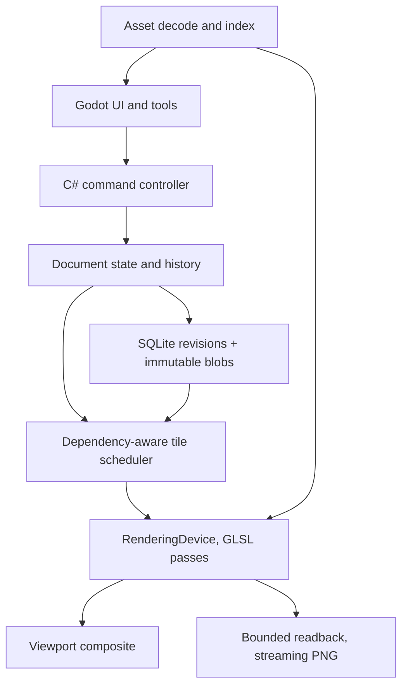

# Malkav's Mapwright: Specification and Architecture (final)

2026-09-21 · Malkav · Project name: Malkav's Mapwright ("Mapwright" in code and file names).  Consolidates `map-editor-spec-claude-v2.md`, `map-editor-spec-claude-v2-astra.md` and `native-map-editor-spec-v1.1.md` (Codex). Astra's engineering structure and corrections are the base; curved text and minimal vector water are restored to P0; the Codex engine gate and asset-pack manifest are kept; research context moves to Appendix A.

## 1. Purpose, scope, decisions

Malkav's Mapwright is a single-user, offline-first native map editor for Windows and Linux with Inkarnate-like painted terrain, coverage masks with coastline effects, placed stamps, paths, labels, and whole-map effects. The immediate purpose is to continue an existing Inkarnate world map with locally generated art, save it reliably, and export it seamlessly at up to 16,384 px per axis.

Decisions for the first implementation:

- P0 outcome: finish one existing world/region map. Recover its terrain and structure from the `.ink` backup, replace missing stamps, paint terrain and masks, edit rivers and curved labels, scatter stamps, save/reopen, undo/redo, export a seamless 16K PNG.
- Stack: Godot 4 .NET (C#) is the default for the prototype: Control-node UI, engine-independent C# document/history/import services, RenderingDevice with GLSL compute/fragment passes for tiles, masks, compositing and effects. The stack is confirmed or rejected at the end of Phase 0 against recorded criteria (section 13). Rust + wgpu is the named alternative; no parallel stack is maintained.
- Import: one-way `.ink` recovery is P0 in visual and structured modes. Structured recovery is parameter-preserving, not pixel-identical.
- Storage: project directory with an authoritative SQLite database and immutable content-hashed blobs. Raster bases are persistent source data; render tiles, distance fields and history acceleration are disposable.
- Rendering: bounded GPU/CPU caches, tiled processing with an explicit effect dependency graph, streaming PNG export.
- History: retained command history with budgeted acceleration. Recent undo is fast; older undo may replay with progress. No promise of unlimited instantaneous undo in fixed space.
- Water: rivers and lakes are editable modifiers that subtract from land coverage. P0 ships editable centreline + width profile and closed-spline lakes; tributary junctions, fill-from-point and sketch-to-river are P1 increments.
- Text: straight and curved labels are P0 because the target map uses curved labels.
- Platforms: Windows first for development; Linux validation before P0 acceptance.
- Assets: externally generated textures and 6–10 base variants per stamp category, scattered by the engine with stored seeds. Generation is outside the editor.

Out of scope: accounts, cloud sync, galleries, marketplace, collaboration, subscriptions, in-app image generation, commercial positioning, public asset-library development. Asset provenance is recorded as practical metadata only.

Rust + wgpu is the alternative if the Godot prototype fails a documented Phase 0 gate. Keep document, storage and import models free of Godot scene types so a renderer change stays possible.

## 2. Native architecture and resource limits

Native execution gives direct local file access, real worker threads, application-controlled cache budgets, system fonts and desktop input. It does not remove RAM/VRAM limits, per-texture limits, driver resets or OOM. Tiling and streaming are architectural choices that a browser app could also make; the reasons to go native here are offline-first, owned budgets, compute shaders, and no subscription.

Inkarnate's export failures are consistent with rendering the whole map into one framebuffer and encoding it in one allocation. That is a hypothesis matching the reported symptoms (memory scaling 4× per resolution step, black regions, context loss), not an established fact about its internals.

The editor queries device limits at startup and allocates within configured budgets. Native access is not unlimited residency or automatic paging.

Resource envelope: recorded from the actual development machine at the start of Phase 0 (GPU, driver, VRAM, RAM, OS). Budgets below are placeholders until then.

| Resource | Initial target |
| --- | --- |
| Editor GPU allocation | 25% of reported VRAM, capped at 4 GiB; reserve headroom for Godot and the compositor |
| Decoded CPU cache | 512 MiB default |
| Export CPU working buffers | 512 MiB default; band height and in-flight jobs shrink to fit |
| Process peak RAM | ≤ 25% of system RAM for the P0 benchmark, including import and export |
| History acceleration cache | 4 GiB on disk default; authoritative history and source assets accounted separately |
| P0 document/export | up to 16,384 × 16,384; no full-size GPU framebuffer |
| P1 scale | sparse documents to 65,536 × 65,536, separate benchmark |

Sizes for reference: a 16,384² RGBA8 image is 1 GiB; RGBA16F is 2 GiB. A 65,536² layer is 16,384 tiles at 512 px or 4,096 at 1,024 px. Those are logical tile counts, not resident allocations.

The CPU cache is backing storage, not a software renderer. If the required GPU backend is unavailable, the rendering editor is unsupported in P0; file inspection and recovery tooling still run.

## 3. Functional priorities

This table is authoritative. Roadmap phases implement it; they do not promote features implicitly.

| Subsystem | P0: finish the existing map | P1: broader editing and scale | P2: optional |
| --- | --- | --- | --- |
| Document | One map per project; logical size to 16K; save, autosave, recovery; immutable source rasters | Multiple maps; sparse 64K; style remapping | Linked nested maps |
| Layers | Brush, raster, object, path, text layers; reorder, rename, hide, lock, solo, opacity; no arbitrary count cap | Groups, blend modes, adjustment layers | General layer effects |
| Terrain | Texture brush: size, hardness, opacity, flow, spacing, rotation/jitter; stable texture anchoring; cursor preview showing size, falloff and affected region | Pen pressure; procedural noise brushes; larger footprints | Height channel, hillshade |
| Masks | Soft coverage painting; coastline stroke, fade, wave rings and isolines from a bounded distance field | Hatching, richer bank effects | Vector coastline editing |
| Water | Editable river (centreline + width profile + bank softness) and closed-spline lake as non-destructive coverage modifiers | Tributary junctions, fill-from-point lakes, sketch-to-river, mouth widening | Elevation-driven descent and flooding |
| Stamps | Import PNG/WebP; place, multi-select, transform, flip, tint, opacity, basic shadow; order list; seeded scatter with persisted placements | Clip modes with a tested compositing contract; flatten with retained source; align/distribute; variants; 50K-instance benchmark | Collision- or terrain-aware placement |
| Paths | Import supported paths; editable polyline/Bezier strokes with width, colour, dashes, caps | Taper; repeated assets along paths (walls, palisades) with spacing, phase, tangent alignment; junction snapping | Road network tools |
| Text | Straight and curved labels; installed or bundled fonts; size, tracking, colour, outline, shadow; font substitution report | Text on arbitrary paths; glow; style presets | Automatic label placement |
| Grid and notes | Square grid with export toggle; pinned notes hidden by default | Hex flat/pointy and isometric grids; pixels-per-cell presets with resulting size shown; note links | Universal VTT walls/doors/lights |
| Selection | Marquee, object-list selection, multi-transform, duplicate, same-map copy/paste | Lasso, cross-map copy/paste | — |
| History | Persistent command history and cursor; recent delta undo; older replay with progress; explicit retention | Named snapshots, optional branches | — |
| Assets | Managed content-hashed assets; folders, tags, search; validation; missing-asset placeholders and report; pack manifest import | Linked assets; SVG; hot reload; Wonderdraft/Dungeondraft pack readers | Community index |
| Filters | Ordered colour adjustment, paper texture, grain; coastline effects; stamp shadows | Blur, sharpen, bloom, LUTs, per-layer filters | Normal-mapped lighting, fog of war |
| Export | Tiled streaming PNG; explicit size and DPI; label/grid toggles; cancellation; atomic publication | JPEG, WebP, TIFF, poster PDF, VTT presets | Layered ORA/PSD |
| UI/input | Mouse; pan/zoom; shortcuts; resizable panels; tablet as pointer | Pressure; dock layouts; themes; multi-window | Scripting API |
| Integration | Revision-labelled JSON of entities, notes, markers | Scribe's Tower mapping | Deeper integration |

P0 does not claim full Inkarnate parity or pixel-faithful import. Unsupported imported properties are preserved in source metadata and listed in the import report.

## 4. Architecture and document model

One process: UI/document controller, Godot's rendering thread, and bounded worker queues for decoding, hashing, storage, compression and encoding. A single document writer orders commands. Workers never touch UI nodes or GPU handles.



The scene graph is application data, not one Godot node per stamp. Authoritative: scene graph, command records, persistent raster bases, referenced assets. Reconstructible: GPU tiles, mipmaps, distance fields, thumbnails, history checkpoints and deltas.

Core records:

- Map: project UUID, map UUID, logical size, style id, layers, grid, notes, effect stack, current revision, history cursor, compatibility versions.
- BrushLayer: optional immutable colour and coverage base references with base-to-document transforms; ordered native strokes; water modifiers; mask effects; opacity; blend mode; provenance.
- RasterLayer: immutable image reference and transform; visibility; opacity; provenance. Used for visual recovery and reference art.
- ObjectLayer: ordered stamp instances, ordering policy (explicit or y-sort), visibility, opacity, shadow style.
- Path, Text, Group: stable entity records with geometry, style, transform, source metadata.
- Stroke: immutable resolved brush parameters, asset hash, document-space dab geometry or sampled curve, pressure/opacity/flow, texture transform, RNG version and seed, brush algorithm version. A mutable brush preset id alone is not replayable.
- StampInstance: asset hash or unresolved source id, affine transform, tint, opacity, shadow, draw-order key, preserved unsupported attributes.
- Command: revision, target ids, payload, reversible data or prior-state reference, referenced blobs.

Ids are UUIDs, or map-scoped numeric ids paired with the map UUID. Copy/paste into another map allocates new ids and rewrites references.

Persistent raster bases: a baked base has intrinsic pixel dimensions and a document transform and stays authoritative if every cache is deleted. Raising export resolution resamples the base; it cannot invent detail. Layers whose paint is reproducible from strokes and managed assets re-render at any resolution; the exporter reports which layers are resampled versus re-rendered before it runs.

Imported history is retained as provenance and as a candidate reconstruction recipe, not replayed over the baked base. Native edits after import form a separate sequence. A verified reconstruction from remapped textures replaces the base at an explicit source revision and reapplies later native edits; the old base stays available for undo until pruned. Each imported layer records whether colour already includes masking or effects (for the sample fixture: colour and coverage are separate PNGs; effects are not baked into layer images, only into the preview composite).

Flattening (P1) creates a persistent raster base and keeps the source entities for unflatten. It is a tracked operation, not a cache.

## 5. Coordinates, resolution, colour, text

Document units: top-left origin, x right, y down, double precision on the CPU. One unit equals one pixel at nominal resolution. Imported geometry passes through an explicit source transform; cached raster dimensions never redefine geometry.

- Export changes sampling density, not geometry. Uniform scale = exportWidth / documentWidth; aspect preserved; nonuniform export rejected in P0.
- Brush radii, path widths, text sizes, shadows, coast widths and grid cells are stored in document units and scale with export. Cursor outlines stay in screen pixels.
- Texture mapping stores origin, scale and rotation in document space; adjacent tiles sample one continuous field regardless of tile size or export order.
- Paper, grain and vignette use document coordinates and stored seeds; noise never restarts per tile.
- DPI metadata changes print size, not pixel count. VTT pixels-per-cell is an explicit size calculation (P1).
- Canvas resize changes bounds with an explicit anchor; content scaling is a separate transform. Unsupported imported resize semantics force partial recovery.
- GPU math uses tile-relative coordinates with explicit document origins.

Colour: assets normalised to sRGB at import with profile handling defined; original bytes kept separately if conversion derives a new asset. Decode to linear light before premultiplication, compositing, blur and shadows. Intermediate tiles are linear premultiplied RGBA16F where supported. Coverage and distance are non-colour data. PNG output is straight-alpha sRGB with matching metadata. Any blend mode added later declares its calculation space and ships reference images.

Text: font identity records face and version when available; missing fonts produce a substitution report. Shaping, rasterisation and placement are separate responsibilities and must use identical logic in viewport and export. The viewport may use an MSDF glyph atlas for zooming; export shapes and rasterises glyphs at target scale. MSDF is an optimisation, not a fidelity guarantee. Curved text is laid out along a Bezier with per-glyph tangent alignment and stored curvature or path reference.

## 6. Coverage masks, distance fields, water

The painted mask is coverage in [0,1], reconstructed from a persistent base plus strokes, preserving soft edges. The distance field is derived.

Coastline is the 0.5 contour of composed coverage. Coverage still controls terrain opacity independently. A translucent region that never reaches 0.5 has no coastline; fixtures make that explicit.

A bounded signed distance field is computed around the contour (negative on land, positive on water), in declared units, clamped to the reach of enabled effects plus sampling support. Stroke and wave rules use distance; fades combine distance with coverage by a specified equation. R16F is used only if tested precision meets tolerance; R32F is the fallback. Generation reads neighbouring coverage out to the required reach; an edit invalidates nearby distance and effect tiles, not just the painted tile. Empty regions carry a clamped sign. Tiled results are compared against a whole-image reference at the same scale; P0 accepts ≤ 0.5 output-pixel distance error within the active band. Effects are resolution-aware approximations rebuilt at export resolution; no claim of exactness at every zoom.

Layer evaluation order: base coverage → painted mask operations → water modifiers → derived distance field → coastline effects.

Water modifiers:

- River: centreline spline, width profile along its length, bank softness, target layer. Its antialiased coverage subtracts from land coverage before distances are recomputed. Lake: closed spline, same subtraction.
- Modifiers always run after land painting. Painting land later does not close a river; edit, disable or delete the modifier. A bake-to-mask operation (P1) folds water into chronological paint history.
- Distances are recomputed from the composed boundary within the band; Boolean combination of separate distance fields is not assumed exact at intersections.
- P0: editable width and outline. P1: tributary junction rules, mouth widening, fill-from-point, sketch-to-river conversion, each with fixtures. P2: elevation-driven flow.

## 7. Tiled rendering, ordering, dependencies

1. Residency: 512 × 512 logical tiles initially. GPU LRU eviction drops reconstructible data or stages it to bounded CPU/disk caches; only the working set of active jobs is pinned; concurrency shrinks rather than exceeding budgets. Mip levels serve zoomed-out views.
2. Brushes: replay only operations whose footprints intersect the requested region; per-layer spatial lookup over strokes and checkpoints. Cache keys include revision, layer, scale, tile coordinates, asset hashes and renderer version.
3. Compositing preserves explicit layer and entity order. Instancing is allowed only for consecutive compatible runs, texture arrays or indexed texture access. Regrouping transparent stamps globally by atlas page is not allowed.
4. Culling and picking: R-tree or loose quadtree updated on transforms. Render bounds include shadows and effects; picking refines candidates with alpha tests. Geometry bounds and expanded effect bounds are kept distinct.
5. Paths and text build CPU geometry or glyph jobs in bounded batches and render through the same tile compositor at target-scale tolerances. Viewport-resolution glyph or SVG caches are never the only export source.
6. Effect graph: each pass declares required input bounds for a requested output rectangle and affected output bounds for a changed input rectangle. Dependencies are walked backward for rendering and export and forward for invalidation, including mask generation, shadows, filters, sampling footprints and mip updates.
7. Halo sizing: sequential finite-support passes accumulate support (two radius-20 blurs need 40). Shadow offsets create asymmetric bounds. Branches union their regions. Infinite kernels use an explicit cutoff; global operations need a prepass or are unsupported.
8. Random and global coordinates reference the document, not the tile origin; random sampling is stable per entity, dab or coordinate.

Clip modes (P1) require a compositing contract: what "nearest brush below" samples, how opacity participates, which earlier objects an erase affects. Imported clip settings are preserved until that contract is tested; a binary stencil does not define soft-alpha erasure.

Export: freeze a revision and pin referenced blobs. Render rectangles with dependencies and halos, crop to interiors, stream scanlines into a row-streaming PNG encoder. Start at 2,048 px interiors and shrink bands to fit. The full budget includes a full-width band, GPU intermediates, readback staging, encoder state and queued jobs; if a required effect footprint cannot fit, preflight fails clearly. Output goes to a temporary sibling; on success flush, validate dimensions and decodability, replace atomically. Cancellation or failure leaves any existing destination intact. Export restarts from the frozen revision after device recovery.

| Format | Milestone | Contract |
| --- | --- | --- |
| PNG | P0 | Streaming, to 16,384 per axis; larger in P1 after benchmark |
| JPEG | P1 | Preflight encoder limits; flatten alpha onto explicit background |
| WebP | P1 | Hard limit 16,383 per axis; a 16,384 map needs downscale or PNG |
| TIFF/BigTIFF | P1 | Tiled/strip encoding with bounded buffers; implementation chosen in a spike |
| Poster PDF | P1 | Page geometry, overlap, crop marks with fixtures |

Notes stay excluded from export by default.

## 8. History, determinism, device loss

Undo/redo: command history plus cursor determine state. One gesture is one step. Undo updates authoritative state first; restoring cached pixels is an optimisation.

- Recent raster gestures keep compressed before/after tile deltas tagged with layer state, resolution and renderer version.
- Without compatible deltas, replay from the nearest checkpoint with progress and cancellation.
- A new command after undo discards the redo branch (P0). Stale caches are invalidated; blobs are retained while any current state, retained history or active export references them.
- Resolution or renderer changes invalidate incompatible deltas; history stays meaningful through commands and immutable sources.
- History and cursor persist in P0; replay recovers acceleration data after restart if it was not saved.

The disk setting limits acceleration caches only. Retained history grows until pruned; pruning is explicit, reports which undo steps are lost, and creates a new baseline. Disk-full leaves the last committed revision intact and stops acknowledging saves.

Determinism: store resolved brush parameters, RNG version and seeds, immutable assets, font identity, coordinate conventions and renderer compatibility version. Persist resolved scatter placements so algorithm changes never move existing stamps. Cross-GPU results need not be bit-identical; tolerances are defined per renderer version. A renderer change that alters output warns and preserves originals; a version number alone does not recreate an old shader.

Device loss: all committed edits live in CPU data; acknowledged saves are on disk; dirty GPU tiles are never read back after loss. On loss: stop submissions, drop GPU handles and caches, cancel render jobs and the uncommitted gesture, keep completed commands, attempt engine recovery, rebuild from sources and history. If the pinned Godot backend cannot recover in process, save pending commands and require an orderly restart. This path is established in Phase 0. Acceptance: no loss of acknowledged saves, no corruption; the in-flight gesture is explicitly discarded.

## 9. Assets, validation, packs

P0 assets are managed copies identified by SHA-256 of stored bytes; import normalisation creates a derived hash and records the original. Renames never break references. Missing assets render as labelled placeholders that keep geometry and source ids.

Metadata: title, category and style tags, default size, anchor, allowed transforms, shadow hint, light direction, variant family, provenance note. SQLite indexes search and tags; decoded pixels, thumbnails, mipmaps and atlas pages are budgeted caches. Decode jobs enforce pixel-count and allocation limits.

Validation, per type:

- Stamps: alpha presence, excess padding, clipped content, coloured fringes, inconsistent family scale or anchor, baked shadows.
- Textures: tileability via half-offset inspection, seam candidates, scale consistency, colour matching; opaque alpha is normal.
- All: duplicate hashes, damaged files, unreasonable dimensions, unsupported profiles.

Warnings assist inspection; they do not certify seamlessness or style consistency. Test generated textures and mountain/tree/building families inside the prototype at map scale and export resolution. Keep a small approved starter set before expanding.

Asset-pack interchange (from Codex 1.1): a pack is a directory or archive with `pack.json` (versioned schema, stable pack-local ids), `assets/`, `thumbnails/`, `LICENSES/`. The manifest may declare name, version, author, source, licence; per-file path and hash; category, tags, family, style; projection and orientation; default scale and anchor; allowed rotation and mirroring; light direction and shadow recommendation; tiling mode and expected texture scale; variants; per-file attribution. Installing a pack never modifies master files. P1 adds linked assets (path + expected hash; changed bytes require explicit update), "collect assets" before packaging, SVG with external resources disabled, and readers for Wonderdraft/Dungeondraft pack layouts supplied by the user.

Imagegen workflow for the starter set: one style prompt per family with fixed light direction and transparent background; textures generated, offset by 50%, seam-inpainted and verified tiled; engine-side normalisation of bounds, anchor and apparent scale; shadows rendered in-engine, never baked.

## 10. Persistence and atomic commits

```text
map.mapwright/
  scene.sqlite            authoritative document, revisions, history cursor, references
  scene.sqlite-wal/-shm   SQLite-managed
  blobs/<hash>            immutable source rasters, stroke chunks, assets, source metadata
  cache/tiles/            disposable rendered tiles and mipmaps
  cache/history/          disposable checkpoints and tile deltas
  previews/               derived thumbnails and last composite
  manifest.json           derived summary, labelled with source revision
  map.json                derived integration export, labelled with source revision
```

Commit protocol:

1. Serialise new blobs to temporary files inside the project filesystem; hash, validate, flush and close with a platform-tested durability path.
2. Publish blobs under their hashes without overwriting different content; establish durability (including directory metadata where required) before committing references.
3. In one SQLite transaction append command and revision records, update materialised state and cursor, add blob references. WAL with `synchronous=FULL` in P0.
4. Acknowledge the saved revision only after commit. Manual save waits for queued commands; autosave batches may delay acknowledgement; the UI distinguishes saved from unsaved.
5. Update previews, manifest, integration JSON and caches asynchronously, labelled with the source revision.

A crash before commit may orphan a blob; it cannot leave a committed reference to a missing blob under the supported filesystem contract. Garbage collection traces current state, retained history, active exports and packaging snapshots. Disk-full aborts publication without touching the previous revision.

Packaging: pause commits briefly, take a SQLite backup through its backup API, pin referenced blobs, resume editing, package the snapshot, validate integrity, reopen the package before publishing. Never replace an open project directory as autosave. Recovery opens SQLite, validates references for the committed revision, discards incomplete temp and cache files, rebuilds derived data. Interruption is tested at every commit boundary. Network shares and cloud-synced directories are outside the P0 storage contract.

## 11. Importing Inkarnate `.ink` files

Observed on the sample (74 MB, gzipped JSON version 3): scene 7,559 × 8,192, style 9, 3,431 transactions including 2,168 `cmd-mask` (polyline strokes with radius, add/subtract, softness, opacity), 611 `cmd-brush` (texture id, scale, rotation, HSB/contrast, geometry), entity add/update/remove/group/move-to-layer, layer add/remove/reorder/visibility/name, composites, a resize log, and `cmd-opened-at-resolution`; 238 stamps, 64 text, 69 `path-v2`, 3 groups, 1 grid; brush and mask PNGs at 3,780 × 4,097 per brush layer; a full-resolution preview. Library stamps and textures are referenced by id and not embedded; object layers have no baked image. Fonts are Google fonts. These are fixture observations; the parser is versioned and tolerant.

| Content | Recovery and caveats |
| --- | --- |
| Scene metadata | Dimensions, style, source ids after validating units and version |
| Mask and brush history | Preserved as provenance; converted to native stroke recipes only for tested geometry, sampling, opacity, texture and resize semantics |
| Entity history | Reconstruct tested add/update/remove/group/layer operations; command coverage does not imply visual parity |
| Stamps | Position, transform, appearance, original `stampId`; unresolved art becomes a placeholder |
| Text | Supported fields including curve; font availability, shaping and spacing verified; substitutions reported |
| Paths and grid | Supported geometry and style; unsupported properties preserved and reported |
| Layer definitions | Ordering, visibility, opacity, mask effects (stroke, inner/outer shadow, isolines); "perspective" ordering treated as y-sort pending a fixture |
| Brush and mask PNGs | Persistent raster bases; colour and coverage are separate, effects not baked (verified for the sample) |
| Preview | Original bytes and intrinsic size, mapped explicitly into document space |

Modes: visual recovery (preview as a locked raster base; new layers above it) and structured recovery (bases plus native entities, placeholders and a remap table). Outcomes: supported structured import, partial structured import, or visual only. The report lists source version, dimensions, supported and unsupported command types with counts, unresolved asset ids with counts, replacements, font substitutions, approximated effects and affected layers, and shows the preview beside the reconstruction.

Unknown commands are skipped only if known independent of later state. An unknown resize, layer transform or ordering command stops trusted replay for affected content; the baked fallback is kept and recovery is marked partial. Remaps are scoped by schema, style, asset type and id and record anchor and scale adjustments. Reconstruction from remapped textures is an explicit previewable operation. Decompression, JSON nesting and image sizes are bounded. Import always creates a new project; the `.ink` is never written.

## 12. Stack and prototype decisions

| Component | P0 direction |
| --- | --- |
| UI | Godot Control nodes, C# tool controllers, plain resizable panels first |
| Document, history, import | Engine-independent C# models and services with versioned serialisation |
| Renderer | RenderingDevice resources, GLSL compute/fragment passes, tile scheduler, explicit lifetimes |
| Storage | SQLite via a maintained .NET binding; hashed blobs; schema migrations |
| Text | Godot text and shaping where fixtures pass; target-scale rasterisation; verified font-file access |
| Paths | C# tessellation or an evaluated library; target-scale tolerance; dash rules |
| Images and export | .NET or native decoders and a genuinely row-streaming PNG encoder, chosen in the spike |
| Workers | Bounded queues for validation, hashing, decoding, thumbnails, compression |

Godot compute requires the RenderingDevice backends; the compatibility renderer is not a fallback. Validate viewport sharing, asynchronous readback, engine overhead and backend recovery in the actual prototype. CI covers document, import and storage logic plus renderer fixtures where possible; manual hardware testing covers the available NVIDIA/AMD/Intel devices on both OSes. A software GPU run does not establish real-driver behaviour.

## 13. Roadmap and acceptance gates

Phase 0, terrain and import prototype (time-boxed to 3–4 weeks at ~15 h/week as an investigation budget, not a delivery promise): Godot window with a persistent imported terrain base, one texture brush, soft mask painting, bounded distance field with stroke/fade/wave effects, one editable river modifier, cache eviction, tiled streaming PNG export, a transparency-order fixture, and a minimal transactional save/reopen path.

| Gate | Target |
| --- | --- |
| Source preservation | Delete all caches, reopen, export: base hashes intact; render matches pre-deletion reference within tolerance |
| Brush latency | p95 input-to-visible-dab ≤ 50 ms over a 30 s boundary-crossing stroke at 1:1, 256-unit brush, four terrain layers |
| Viewport | p95 frame time ≤ 33.3 ms on the pan/zoom benchmark at 1920 × 1080; report median and p95 |
| Memory | Within section 2 budgets during import, painting and 16K export; RAM and GPU recorded separately |
| Export time | ≤ 120 s provisional for the 16K fixture; revise only with evidence |
| Seams | Tiled vs whole-image renders of small fixtures: ≤ 1 channel value difference, no boundary-correlated artefacts; distance error ≤ 0.5 px |
| Dependencies | Harness includes two sequential radius-20 blurs, offset shadows, corner-crossing stamps, coastline rings, grain, texture sampling, a river crossing a tile boundary |
| Ordering | Alternating atlas-page transparent stamps match an unbatched draw-order reference |
| Save and recovery | Interruption before and after blob publication, transaction commit and derived-file update reopens to the last acknowledged revision with no missing references |
| Device loss | Injected invalidation during edit and export restores saved state via recovery or restart; no post-loss GPU readback |
| Import degradation | Fixtures for missing assets and fonts, unknown state-changing commands, different cache resolutions and baked effects produce correct reports without double painting |
| Undo | Recent undo p95 ≤ 100 ms for ≤ 16 resident tiles; evicted-history undo shows progress and reconstructs correctly; new edits invalidate redo |
| Engine decision | Written decision comparing Godot 4 + C# against Rust + wgpu on measured export behaviour, tile control, readback, device-loss path, tablet input, panel complexity, text, packaging and developer familiarity |

Phase 1, durable editing core: commit protocol, autosave status, recovery, persistent history, brush and raster layers, masks, water modifiers, resource-budget UI, import reports, visual and structured recovery, integration JSON, safe packaging.

Phase 2, usable map workflow: asset browser and validation, pack manifest import, stamp transforms and ordered batching, seeded scatter, shadows, selection, paths, straight and curved text, square grid, notes. Finish remapping and compare the real imported map to its preview. Complete the map end to end with the approved starter set.

Phase 3, P0 acceptance and platform validation: run the suite on the supported Windows and Linux configurations; finish input feedback, shortcuts, cancellation, missing-data reporting, documentation.

Phase 4, P1 expansion by real use: tributaries and fill-from-point, clip modes, repeated assets along paths, hex and isometric grids, richer filters, pressure, VTT presets, additional export formats, then sparse 64K. Each addition declares its memory, dependency and import contract first. A 50K-stamp scene is tested with specified visibility and overdraw.

P2 backlog: elevation-aware terrain and water, automatic label placement, nested maps, layered export, scripting, lighting and VTT features.

The earlier 9–14 month figure is historical context. Re-estimate after Phase 0 from measured rendering, import, persistence and UI work.

## 14. Remaining decisions and risks

1. Import semantics: build a versioned fixture corpus from the sample; command names and cache geometry do not establish rendering fidelity.
2. Godot integration: prove bounded render and readback and the device-loss restart path before Phase 0 closes.
3. Appearance: judge terrain, masks and generated stamp families together at working scale; coherence beats asset count.
4. Dependency cost: large effect bands and zoomed-out composites can exceed a naive working set; preflight and reduce concurrency rather than rely on paging.
5. Durability: validate flush and publication on the actual filesystems in use.
6. Retention: source and history growth is visible and separate from caches; pruning never silently breaks current content.
7. Buy-vs-build (Appendix A): the build is justified only by the painted-terrain model, post-creation resolution changes and the `.ink` history. Re-check after Phase 0.

Open: pinned engine and .NET versions, streaming PNG implementation, SQLite binding, tessellation library, benchmark hardware.

## Appendix A. Research context

Inkarnate is a layered raster painter with a stamp library, four map categories (world/region, city/village, battlemap, scene/isometric) and closed art styles per category. Canvas size is fixed at creation (1K/2K free, 3K/4K Creator; 8K export Creator, 16K Studio). Brush layers hold painted textures; a land mask controls visibility with auto coastline effects; 2.0 added user-created object layers, clip masks and per-layer opacity; pattern stamps scatter mountains and forests along a stroke; paths, curved text, notes, grids, per-style filters, VTT export presets (Roll20 70/140, Foundry 100, Fantasy Grounds 50 px per square), custom art upload (10,000 slots on Studio). Storage is cloud-only with no offline mode. Reported pain points: exports fail by memory exhaustion at 4K–16K, context loss crashes the editor, no brush preview, small fixed layer model. The company reversed an AI-marketplace policy in October 2025 after a boycott; generative assets are acceptable for personal use only.

Native vs browser: native buys owned budgets, compute, threads, direct files and system fonts; it costs installer and driver variance. A tiled WebGPU app could export 16K on modest hardware; native is justified by offline-first plus owned budgets plus no subscription.

Alternatives: Wonderdraft and Dungeondraft (both Godot, essentially solo-developed, one-time purchase) cover most of the feature list except Inkarnate's painted-terrain model, post-creation resolution changes and `.ink` history. Their art style was rejected for this project.

Sources: Inkarnate FAQ; Loreteller guides on layers, export failures, battle-map sizing and the Wonderdraft comparison; Dungeon Goblin review; TTRPG Stack; char-gen; Geek Native on the AI policy reversal; direct inspection of the sample `.ink`; Codex drafts 1.0 and 1.1; Astra revision.
