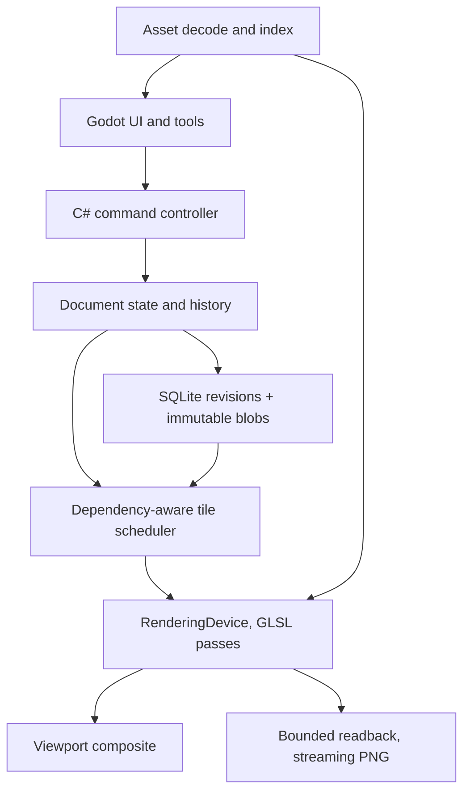

# Malkav's Mapwright: Specification and Architecture (final)

2026-09-21 · Malkav · Project name: Malkav's Mapwright ("Mapwright" in code and file names).  Consolidates `map-editor-spec-claude-v2.md`, `map-editor-spec-claude-v2-astra.md` and `native-map-editor-spec-v1.1.md` (Codex). Astra's engineering structure and corrections are the base; curved text and minimal vector water are restored to P0; the Codex engine gate and asset-pack manifest are kept; research context moves to Appendix A.

This is the working specification, incorporating the later project decisions. The [original final specification](reference/map-editor-spec-final.md) is preserved unchanged as source material. Acceptance targets describe required behavior, not completed implementation.

2026-09-22 terrain-model amendment (user decision during Phase 1 discussion): P0 has exactly two terrain layers, Background and Foreground. Foreground owns the single editable land/coastline mask; mixed object layers containing stamps, paths and text sit above both. This supersedes the earlier arbitrary brush/raster-layer model and four-terrain-layer acceptance workload. Historical source files and probe results retain their original wording; this is a Mapwright product decision, not a newly verified claim about Inkarnate.

2026-09-22 coastline amendment: prefer one fixed style on the outer land/sea coast, with no decorative styling on river or lake banks. Defer coastline styling controls, decorative fades, wave rings and isolines beyond P0. If reliable coast-versus-inland-water separation proves too involved, ship without generated edge styling; this fallback is explicitly authorized. Basic soft-mask editing, water geometry, correct colour/alpha and seamless rendering remain required. Distance-field acceptance applies only when that rendering path is used.

Phase 3 lake amendment (2026-09-22): provide both ordinary Land-tool subtraction to create a lake by revealing Background, and water texture or solid-colour painting on Foreground. Mask lakes edit coverage; painted lakes edit colour without changing coverage. Dedicated closed-spline lake entities/modifiers are deferred. River geometry and its post-mask modifier behavior remain unchanged. This supersedes earlier P0 spline-lake wording, including the lake portion of Phase 1 D-08.

2026-09-22 Phase 3 object-layer amendment: each object layer may mix stamps, paths and text. Object-placing tools keep the selected object layer; if Background or Foreground is selected, visibly switch to the topmost object layer. Existing hidden/locked target guards remain. Each tool retains its own parameters independently: stamp size, brush size and text size never carry across tools. Texture Brush settings still carry across its Background/Foreground targets. Every map starts with one automatically created object layer alongside Background, Foreground and Grid. Grid implementation remains in Phase 4. The last remaining object layer cannot be deleted, but its contents can be cleared.

2026-09-22 Phase 3 recovery simplification: recovery reopens the latest durably saved Mapwright project, including acknowledged autosaved edits. Only an unfinished, unacknowledged gesture may be lost. Keep initial .ink import and its concise summary, source preservation, ordinary asset/font replacement and undo. For import reconstruction, provide side-by-side original/reconstructed comparison with linked pan/zoom and a concise summary. Reconstruction happens only during initial import: review the comparison, accept the result and continue editing the saved Mapwright project. Later base reconstruction is deferred.

2026-09-22 Phase 3 label/path/note decisions: freehand paths use gentle smoothing and stay ready for another stroke; labels use side-panel text entry and Straight/Curve/S-shape controls as detailed in §5. Notes can be added through the Note tool or map context menu, edited in the side panel and revealed as pins only; default hidden/image-excluded behavior remains.

## 1. Purpose, scope, decisions

Malkav's Mapwright is a single-user, offline-first native map editor for Windows and Linux with Inkarnate-like painted terrain, coverage masks with coastline effects, placed stamps, paths, labels, and whole-map effects. The immediate purpose is to continue an existing Inkarnate world map with locally generated art, save it reliably, and export it seamlessly at up to 16,384 px per axis.

Decisions for the first implementation:

- P0 outcome: finish one existing world/region map. Recover its terrain and structure from the `.ink` backup, replace missing stamps, paint terrain and masks, edit rivers and curved labels, scatter stamps, save/reopen, undo/redo, export a seamless 16K PNG.
- Stack: Godot 4 .NET (C#) is selected for the first implementation: Control-node UI, engine-independent C# document/history/import services, RenderingDevice with GLSL compute/fragment passes for tiles, masks, compositing and effects. The [2026-09-22 engine decision](engine-decision.md) resolves the original prototype choice; it does not close the remaining Phase 0 gates (section 13). Rust + wgpu remains the named alternative only if a demonstrated engine constraint justifies reconsideration; no parallel stack is maintained.
- Import: one-way `.ink` recovery is P0 in visual and structured modes. Structured recovery is parameter-preserving, not pixel-identical.
- Terrain layers: Background below Foreground, with fixed role/order and no add, duplicate, remove or reorder terrain-layer operation in P0. Both support texture painting, visibility, lock, solo and opacity; a display-name change must retain the visible role identity. Only Foreground has editable land coverage and coastline effects. Additional layers contain objects, paths or text above the terrain pair; they remain reorderable without an arbitrary count cap.
- Storage: project directory with an authoritative SQLite database and immutable content-hashed blobs. Raster bases are persistent source data; render tiles, distance fields and history acceleration are disposable.
- Rendering: bounded GPU/CPU caches, tiled processing with an explicit effect dependency graph, streaming PNG export.
- Export priority: correctness and recoverability outrank speed. A 16K export taking roughly five minutes is acceptable. Duration is recorded as an observation, not a pass/fail gate; optimisation must not consume resources or scheduling priority needed for responsive editing.
- History: retained command history with budgeted acceleration. Recent undo is fast; older undo may replay with progress. No promise of unlimited instantaneous undo in fixed space.
- Water: editable rivers use centreline, width profile and bank softness as coverage modifiers. Lakes can be made with Land → Subtract, or painted with a water texture/solid colour on Foreground. Dedicated spline-lake modifiers, tributary junctions, fill-from-point and sketch-to-river are deferred beyond P0.
- Text: straight and curved labels are P0 because the target map uses curved labels.
- Platforms: Windows first for development; Linux validation before P0 acceptance.
- Assets: externally generated textures and 6–10 base variants per stamp category, scattered by the engine with stored seeds. Generation is outside the editor.

Out of scope: accounts, cloud sync, galleries, marketplace, collaboration, subscriptions, in-app image generation, commercial positioning, public asset-library development. Asset provenance is recorded as practical metadata only.

Keep document, storage and import models free of Godot scene types so a renderer change stays possible. A failed Phase 0 target first requires attribution to algorithm, scheduling, allocation, synchronization or an engine constraint; it does not automatically reopen the stack decision.

## 2. Native architecture and resource limits

Native execution gives direct local file access, real worker threads, application-controlled cache budgets, system fonts and desktop input. It does not remove RAM/VRAM limits, per-texture limits, driver resets or OOM. Tiling and streaming are architectural choices that a browser app could also make; the reasons to go native here are offline-first, owned budgets, compute shaders, and no subscription.

Inkarnate's export failures are consistent with rendering the whole map into one framebuffer and encoding it in one allocation. That is a hypothesis matching the reported symptoms (memory scaling 4× per resolution step, black regions, context loss), not an established fact about its internals.

The editor queries device limits at startup and allocates within configured budgets. Native access is not unlimited residency or automatic paging.

Resource envelope: recorded from the actual development machine at the start of Phase 0 (GPU, driver, VRAM, RAM, OS). Budgets below are placeholders until then.

| Resource | Initial target |
| --- | --- |
| Editor GPU allocation | 25% of reported VRAM, capped at 4 GiB; reserve headroom for Godot and the compositor |
| Decoded CPU cache | 512 MiB default |
| Export CPU working buffers | 512 MiB default; band height and in-flight jobs shrink to fit |
| Process peak RAM | ≤ 25% of system RAM for the P0 benchmark, including import and export |
| History acceleration cache | 4 GiB on disk default; authoritative history and source assets accounted separately |
| P0 map/export | Map longest edge: 1,000 map units; PNG up to 16,384 px per axis; no full-size GPU framebuffer |
| P1 scale | sparse documents to 65,536 × 65,536, separate benchmark |

Sizes for reference: a 16,384² RGBA8 image is 1 GiB; RGBA16F is 2 GiB. A 65,536² layer is 16,384 tiles at 512 px or 4,096 at 1,024 px. Those are logical tile counts, not resident allocations.

The CPU cache is backing storage, not a software renderer. If the required GPU backend is unavailable, the rendering editor is unsupported in P0; file inspection and recovery tooling still run.

## 3. Functional priorities

This table is authoritative. Roadmap phases implement it; they do not promote features implicitly.

| Subsystem | P0: finish the existing map | P1: broader editing and scale | P2: optional |
| --- | --- | --- | --- |
| Document | One map per project; fixed 1,000-unit longest edge with independent editing/export resolution; PNG to 16K; save, autosave, recovery; immutable source rasters | Multiple maps; sparse 64K; style remapping | Linked nested maps |
| Layers | Exactly two terrain roles: Background below Foreground, with rename/role identity, hide, lock, solo and opacity; Foreground owns the coastline mask. Reorderable mixed object layers containing stamps, paths and text above them, without an arbitrary object-layer count cap | Groups, blend modes, adjustment layers; reconsider additional terrain layers only through an explicit scope decision | General layer effects |
| Terrain | Texture brush with preset library and edged variant: diameter, hardness, opacity, flow, spacing, texture scale/rotation and jitter; roughness/corner smoothing for edged tips; automatic start/end taper on tapered presets; stable texture anchoring and footprint/falloff preview | Pen pressure; procedural noise brushes; larger footprints | Height channel, hillshade |
| Masks | One soft land-coverage mask owned by Foreground; add/subtract coverage, revealing Background; prefer a fixed outer-coast style with unstyled river/lake banks, or omit generated styling if separation is too involved; no separate mask layers or coastline styling controls | Coastline styling controls, decorative fades, wave rings, isolines, hatching and richer bank effects | Vector coastline editing |
| Water | Editable river (centreline + width profile + bank softness) as a non-destructive coverage modifier; lakes via Land subtraction or water texture/solid-colour painting on Foreground | Dedicated closed-spline lake modifiers; tributary junctions, fill-from-point lakes, sketch-to-river, mouth widening | Elevation-driven descent and flooding |
| Stamps | Import PNG/WebP; place, multi-select, transform, flip, tint, opacity, basic shadow; order list; seeded scatter with persisted placements | Clip modes with a tested compositing contract; flatten with retained source; align/distribute; variants; 50K-instance benchmark | Collision- or terrain-aware placement |
| Paths | Freehand creation with gentle automatic smoothing; stay ready for another path; supported import and polyline/Bezier point editing with width, colour, dashes and caps | Taper; repeated assets along paths (walls, palisades) with spacing, phase, tangent alignment; junction snapping | Road network tools |
| Text | Side-panel text editing; Straight, Curve and S-shape modes; bundled fonts first, installed separately; size, tracking, colour, outline, shadow; previewed missing-font replacement | Text on arbitrary paths; freeform curve editing; independent S-bend controls; glow; style presets | Automatic label placement |
| Grid and notes | Topmost default Grid row, initially hidden; initial counts set aspect/starting grid, spacing in map units; export inclusion follows canvas with override; pinned notes hidden by default | Hex flat/pointy and isometric grids; pixels-per-cell presets with resulting size shown; note links | Universal VTT walls/doors/lights |
| Selection | Marquee, object-list selection, multi-transform, duplicate, same-map copy/paste | Lasso, cross-map copy/paste | — |
| History | Persistent command history and cursor; recent delta undo; older replay with progress; explicit retention | Named snapshots, optional branches | — |
| Assets | Managed content-hashed assets; folders, tags, search; validation; missing-asset placeholders and report; pack manifest import | Linked assets; SVG; hot reload; Wonderdraft/Dungeondraft pack readers | Community index |
| Filters | Toolbar Appearance panel: ordered colour adjustment, selectable paper texture with strength/scale/rotation, grain; preserve any fixed outer-coast style and stamp shadows | Blur, sharpen, bloom, LUTs, per-layer filters | Normal-mapped lighting, fog of war |
| Export | Preset-resolution streaming PNG, optional DPI, canvas-derived label/grid toggles; current-state editable ZIP without undo history; dated default filenames; cancellation and safe publication | JPEG, WebP, TIFF, poster PDF, VTT presets, custom dimensions, full-history package variants | Layered ORA/PSD |
| UI/input | Mouse; pan/zoom; shortcuts; resizable panels; tablet as pointer | Pressure; dock layouts; themes; multi-window | Scripting API |
| Integration | Manual revision-labelled JSON export of all entities, notes and markers, including hidden content and visibility; dated filename | Scribe's Tower mapping; automatic companion export | Deeper integration |

P0 does not claim full Inkarnate parity or pixel-faithful import. Unsupported imported properties are preserved in source metadata and listed in the import report.

## 4. Architecture and document model

One process: UI/document controller, Godot's rendering thread, and bounded worker queues for decoding, hashing, storage, compression and encoding. A single document writer orders commands. Workers never touch UI nodes or GPU handles.



The scene graph is application data, not one Godot node per stamp. Authoritative: scene graph, command records, persistent raster bases, referenced assets. Reconstructible: GPU tiles, mipmaps, distance fields, thumbnails, history checkpoints and deltas.

Core records:

- Map: project UUID, map UUID, logical size, style id, layers, grid, notes, effect stack, current revision, history cursor, compatibility versions.
- TerrainLayer: one of two stable roles, Background or Foreground; immutable colour base with base-to-document transform, ordered native texture strokes, visibility, lock, opacity and provenance. Foreground additionally owns the immutable coverage base, native mask strokes, water modifiers and coastline effects. Background has no independently editable land mask. Role cardinality and order are domain invariants, including command validation and reopening.
- RecoveryReference: immutable original preview/image and transform, source identity and provenance. It is retained for comparison and visual recovery, not an additional user-created terrain layer. In visual recovery, the flattened preview backs a locked Background and Foreground starts without new land coverage; new terrain work goes on Foreground. The review must explain that existing baked land/coasts remain visual content, not editable recovered mask geometry.
- ObjectLayer: explicitly ordered mixed stamp, path and text entities, visibility, lock, solo, opacity and preserved source metadata. Every map starts with one object layer; the last cannot be deleted. Object layers remain above the fixed terrain pair.
- Path, Text, Group: stable entity records with geometry, style, transform, source metadata.
- Stroke: immutable resolved brush parameters, texture asset hash or stored solid-colour paint source, document-space dab geometry or sampled curve, pressure/opacity/flow, texture transform, RNG version and seed, brush algorithm version. A mutable brush preset id alone is not replayable.
- StampInstance: asset hash or unresolved source id, affine transform, tint, opacity, shadow, draw-order key, preserved unsupported attributes.
- Command: revision, target ids, payload, reversible data or prior-state reference, referenced blobs.

Ids are UUIDs, or map-scoped numeric ids paired with the map UUID. Copy/paste into another map allocates new ids and rewrites references.

Persistent raster bases: a baked base has intrinsic pixel dimensions and a document transform and stays authoritative if every cache is deleted. Raising export resolution resamples the base; it cannot invent detail. Layers whose paint is reproducible from strokes and managed assets re-render at any resolution; the exporter reports which layers are resampled versus re-rendered before it runs.

Imported history is retained as provenance, not replayed over the baked base. Native edits after import form a separate sequence. P0 does not provide a user-facing operation to reconstruct or replace the imported base from remapped textures and reapply later native edits; that workflow is deferred. The saved Mapwright project is authoritative after import. Each imported layer records whether colour already includes masking or effects (for the sample fixture: colour and coverage are separate PNGs; effects are not baked into layer images, only into the preview composite).

Recovery maps tested source terrain roles into Background colour and Foreground colour/coverage without exposing extra editable terrain or mask layers. Retain every original source raster, source ID and unsupported property. If extra source terrain/masks cannot be mapped faithfully, report partial recovery and offer the preserved visual fallback; do not silently discard them or imply that a flattened preview provides an editable original coastline. Non-terrain content occupies layers above the fixed terrain pair; unsupported interleaving is preserved in provenance and reported.

Flattening (P1) creates a persistent raster base and keeps the source entities for unflatten. It is a tracked operation, not a cache.

## 5. Coordinates, resolution, colour, text

Phase 4 resolution amendment (2026-09-23, settled): initial columns/rows establish map proportions and the starting Grid; later grid-spacing changes do not resize the map. Editing resolution is selected at creation/import and fixed afterward for P0. Export resolution is independent; both resolution labels refer to the longest edge. All map-relative sizes use stable map units, superseding earlier map-pixel size/spacing wording in prior contexts. The longest map edge is 1,000 map units and the other edge follows its aspect ratio, independent of grid counts. Editing presets are 1K, 2K, 3K and 4K; export presets are 1K, 2K, 3K, 4K, 8K and 16K, with no custom resolution field in P0. K uses the longest-edge convention (1K = 1,024 pixels; 3K = 3,072 pixels; 16K = 16,384 pixels). Label/grid inclusion initially follows current canvas visibility and can be overridden for the export without changing the canvas.

Document units: top-left origin, x right, y down, double precision on the CPU. Map units define geometry independently of editing and export pixel resolution. All map-relative sizes use these stable units. The longest map edge spans 1,000 units; for a 4:3 map, geometry spans 1,000 x 750 units. A 40 x 30 initial grid then has 25-unit cells. Fractional coordinates are supported. Screen-space UI markers remain in screen pixels. Imported geometry passes through an explicit source transform; cached raster dimensions never redefine geometry.

- Export changes sampling density, not geometry. Uniform scale = exportWidth / documentWidth; aspect preserved; nonuniform export rejected in P0.
- Brush radii, path widths, text sizes, shadows, coast widths and grid cells are stored in document units and scale with export. Cursor outlines stay in screen pixels.
- Texture mapping stores origin, scale and rotation in document space; adjacent tiles sample one continuous field regardless of tile size or export order.
- Paper, grain and vignette use document coordinates and stored seeds; noise never restarts per tile.
- DPI metadata changes print size, not pixel count. VTT pixels-per-cell is an explicit size calculation (P1).
- Canvas resize changes bounds with an explicit anchor; content scaling is a separate transform. Unsupported imported resize semantics force partial recovery.
- GPU math uses tile-relative coordinates with explicit document origins.

Colour: assets normalised to sRGB at import with profile handling defined; original bytes kept separately if conversion derives a new asset. Decode to linear light before premultiplication, compositing, blur and shadows. Intermediate tiles are linear premultiplied RGBA16F where supported. Coverage and distance are non-colour data. PNG output is straight-alpha sRGB with matching metadata. Any blend mode added later declares its calculation space and ships reference images.

Text: edit content in the side panel with live preview. Font identity records face and version where available; show bundled fonts first and installed fonts separately. Missing-font replacement defaults to all labels using that font in the current map, previewed before Apply with ordinary undo and retained original identity. Shaping, rasterisation and placement use identical logic in viewport and export; an MSDF viewport atlas is optional, not a fidelity guarantee. Label modes are Straight, Curve and S-shape. Curve uses -100% to +100% peak deflection: 0% straight, +100% a semicircle, -100% its opposite bend. S-shape uses one signed percentage for two equal, opposite bends; sign reversal reverses the S. Store mode/parameters and tangent-align glyphs along the resulting baseline. A Bezier representation may be internal; arbitrary user-edited label handles or independent path attachment are not P0 requirements.

## 6. Coverage masks, distance fields, water

The single editable painted mask belongs to Foreground: coverage in [0,1], reconstructed from its persistent base plus mask strokes, preserving soft edges. It controls how Foreground reveals Background. Texture painting changes the chosen terrain layer's colour without changing land coverage; the mask tool changes Foreground coverage without painting texture. Background has no coastline mask, and masks are not standalone layers. The distance field is derived from Foreground coverage.

Land-mask brush modes are Edged polygon and Round soft, both with Add/Subtract and brush diameter in map units. Edged mode exposes Roughness and Smooth; round mode exposes Softness. The full texture-brush preset library is not shared with the Land tool. Texture painting additionally supports an edged variant, with texture scale/rotation distinct from footprint size/roughness. Smooth rounds sharp polygon-footprint corners while retaining a firm irregular edge; it does not soften alpha or stabilize hand movement. Tapered texture presets automatically narrow at both stroke ends without pressure. Exact preset inventory and numeric defaults/ranges remain design/research details; supplied screenshot values are references, not defaults. This does not imply pressure support or custom brush-tip import in P0.

The land/water boundary is the 0.5 contour of composed coverage. Coverage still controls terrain opacity independently. A translucent region that never reaches 0.5 has no contour to style. Outer-coast styling must exclude river/lake banks, including a river mouth meeting the sea; the combined coverage field alone does not establish that distinction.

P0 styling is one fixed, modest outer-coast treatment with no user-facing style inspector. Keep native river identity through composition; lake painting creates no semantic lake object. Colour-only lakes add no coverage contour to style; ordinary mask-cut lakes require reliable inland-boundary handling or the authorized unstyled fallback. An implementation may retain pre-water coverage or boundary provenance to exclude their banks, but must verify mouths, lake edges and tile crossings. Water connectivity alone is insufficient because rivers can connect to the sea. Imported baked styling remains part of the preserved source image; do not promise to remove it. Ambiguous recovered coverage must not be presented as reliably classified. If trustworthy separation requires disproportionate complexity, omit generated edge styling for the initial implementation rather than styling inland banks. Record the chosen implementation and reason in phase verification; do not add a user classification workflow or extra layers to solve it.

If the fixed style uses a bounded signed distance field, compute it around the declared source contour (negative on land, positive on water), in declared units, clamped to the active effect reach plus sampling support. Record that contour and any provenance used to exclude inland banks. R16F is used only if tested precision meets tolerance; R32F is the fallback. Generation reads neighbouring coverage out to the required reach; an edit invalidates nearby distance and effect tiles, not just the painted tile. Empty regions carry a clamped sign. Tiled results are compared against a whole-image reference at the same scale; require ≤ 0.5 output-pixel distance error within the active band against that contour. If the unstyled fallback does not use distance fields, this distance-specific gate is not applicable; soft-alpha and tiled/whole colour correctness still apply. Decorative fade, wave-ring and isoline passes are deferred, not prerequisites for mask editing.

Foreground evaluation order: base coverage → painted mask operations → water modifiers → final soft coverage. Preserve boundary identity as needed for the optional fixed outer-coast treatment; any distance/style passes follow their declared dependencies. Composite Background, then masked Foreground and the fixed coast treatment if implemented, then the ordered mixed object layers (stamps, paths and text). Layer opacity remains separate from land coverage. River bank softness and Land-brush softness are coverage antialiasing, not decorative coastline styling; painted lake edges follow their paint brush, without changing the land mask.

Water modifiers:

- River: centreline spline, width profile along its length and bank softness, always targeting Foreground in P0. Its antialiased coverage subtracts from Foreground land coverage before distances are recomputed, revealing Background. A river creates no additional terrain or mask layer.
- Modifiers always run after land painting. Painting land later does not close a river; edit, disable or delete the modifier. A bake-to-mask operation (P1) folds water into chronological paint history.
- Where distances are used, recompute from the declared contour within the band; Boolean combination of separate distance fields is not assumed exact at intersections. Do not transfer outer-coast decoration to river/lake banks.
- Lakes, P0: use the existing Land tool in Subtract mode with its edged/round brush to reveal Background, or choose Foreground and paint a water texture or solid colour with the painting brushes. Show the current paint source and target. Land Add can refill a mask-cut lake; later colour strokes can cover a painted lake. Both support ordinary gesture undo/redo, save/reopen and export. Neither is a persistent lake modifier with handles, disable/delete controls or protected shape.
- P1: dedicated closed-spline lake modifiers, tributary junction rules, mouth widening, fill-from-point and sketch-to-river conversion, each with fixtures. P2: elevation-driven flow.

## 7. Tiled rendering, ordering, dependencies

1. Residency: 512 × 512 raster-pixel tiles at the selected sampling level initially. GPU LRU eviction drops reconstructible data or stages it to bounded CPU/disk caches; only the working set of active jobs is pinned; concurrency shrinks rather than exceeding budgets. Mip levels serve zoomed-out views.
2. Brushes: replay only operations whose footprints intersect the requested region; per-layer spatial lookup over strokes and checkpoints. Cache keys include revision, layer, scale, tile coordinates, asset hashes and renderer version.
3. Compositing preserves explicit layer and entity order. Instancing is allowed only for consecutive compatible runs, texture arrays or indexed texture access. Regrouping transparent stamps globally by atlas page is not allowed.
4. Culling and picking: R-tree or loose quadtree updated on transforms. Render bounds include shadows and effects; picking refines candidates with alpha tests. Geometry bounds and expanded effect bounds are kept distinct.
5. Paths and text build CPU geometry or glyph jobs in bounded batches and render through the same tile compositor at target-scale tolerances. Viewport-resolution glyph or SVG caches are never the only export source.
6. Effect graph: each pass declares required input bounds for a requested output rectangle and affected output bounds for a changed input rectangle. Dependencies are walked backward for rendering and export and forward for invalidation, including mask generation, shadows, filters, sampling footprints and mip updates.
7. Halo sizing: sequential finite-support passes accumulate support (two radius-20 blurs need 40). Shadow offsets create asymmetric bounds. Branches union their regions. Infinite kernels use an explicit cutoff; global operations need a prepass or are unsupported.
8. Random and global coordinates reference the document, not the tile origin; random sampling is stable per entity, dab or coordinate.

Clip modes (P1) require a compositing contract: what "nearest brush below" samples, how opacity participates, which earlier objects an erase affects. Imported clip settings are preserved until that contract is tested; a binary stencil does not define soft-alpha erasure.

Export: freeze a revision and pin referenced blobs. Render rectangles with dependencies and halos, crop to interiors, stream scanlines into a row-streaming PNG encoder. Start at 2,048 px interiors and shrink bands to fit. The full budget includes a full-width band, GPU intermediates, readback staging, encoder state and queued jobs; if a required effect footprint cannot fit, preflight fails clearly. Output goes to a temporary sibling; on success flush, validate dimensions and decodability, replace atomically. Cancellation or failure leaves any existing destination intact. Export restarts from the frozen revision after device recovery.

Export acceptance is based on correct output, bounded RAM and GPU residency, observable progress, responsive cancellation, and preservation of any previous destination after cancellation or failure. Wall-clock duration is reported but has no pass/fail threshold. Export work yields to interactive rendering; a faster export is not an acceptable trade for painting or navigation stalls.

| Format | Milestone | Contract |
| --- | --- | --- |
| PNG | P0 | Streaming, to 16,384 per axis; larger in P1 after benchmark |
| JPEG | P1 | Preflight encoder limits; flatten alpha onto explicit background |
| WebP | P1 | Hard limit 16,383 per axis; a 16,384 map needs downscale or PNG |
| TIFF/BigTIFF | P1 | Tiled/strip encoding with bounded buffers; implementation chosen in a spike |
| Poster PDF | P1 | Page geometry, overlap, crop marks with fixtures |

Notes stay excluded from PNG/image export by default; manual JSON export includes all notes, even hidden ones. PNG label/grid toggles start from canvas visibility and override only the export. Optional DPI defaults to 300 and affects metadata, not selected pixels. Default PNG, ZIP and JSON filenames combine map name with a filesystem-safe date/time.

## 8. History, determinism, device loss

Undo/redo: command history plus cursor determine state. One gesture is one step. Undo updates authoritative state first; restoring cached pixels is an optimisation.

- Recent raster gestures keep compressed before/after tile deltas tagged with layer state, resolution and renderer version.
- Without compatible deltas, replay from the nearest checkpoint with progress and cancellation.
- A new command after undo discards the redo branch (P0). Stale caches are invalidated; blobs are retained while any current state, retained history or active export references them.
- Resolution or renderer changes invalidate incompatible deltas; history stays meaningful through commands and immutable sources.
- History and cursor persist in P0; replay recovers acceleration data after restart if it was not saved.

Project Settings > Storage separates current map/assets/sources, retained history and disposable caches with distinct cleanup actions. The disk setting limits acceleration caches only. Retained history grows until pruned; select a history-list cutoff, preview lost older undo steps, confirm explicitly and create a new baseline. Disk-full leaves the last committed revision intact and stops acknowledging saves.

Determinism: store resolved brush parameters, RNG version and seeds, immutable assets, font identity, coordinate conventions and renderer compatibility version. Persist resolved scatter placements so algorithm changes never move existing stamps. Cross-GPU results need not be bit-identical; tolerances are defined per renderer version. A renderer change that alters output warns and preserves originals; a version number alone does not recreate an old shader.

Device loss: authoritative edits live in CPU data and a durable on-disk command journal; dirty GPU tiles are never a recovery source. Each completed command is appended and flushed to disk before the UI acknowledges it or submits dependent GPU work. The active, unacknowledged gesture may be discarded. On the tested Windows/AMD configuration, Godot can terminate natively after Vulkan device loss, so recovery must not depend on post-loss managed code, saving pending commands, orderly GPU cleanup or in-process renderer recreation. A fresh process reopens the last acknowledged revision, replays its journal and rebuilds disposable GPU caches. Export always targets a temporary sibling, leaving the previous destination intact until the new result is flushed and validated. Acceptance: forced termination during editing and export loses no acknowledged command, corrupts no project, never publishes partial output and requires no post-loss GPU readback.

## 9. Assets, validation, packs

Phase 2 decisions (2026-09-22): use a shared local library across projects with category-first thumbnails and pack/folder/tag filters. Each project retains immutable assets needed by current, history, export and package references; shared-library removal or reorganization must not invalidate saved projects. Loose images without pack metadata get a quick category/tag review. Usable images with quality warnings import with badges; damaged, unsupported or over-budget files are rejected.

Missing-art placeholders are subtle outlined footprints with a warning marker and details on hover/selection. Replacement defaults to all matching instances in the current map, with preview/count and scope override. Fit each original footprint without stretching, preserve positions and source IDs, and preview size/anchor corrections. Report unknown original bounds. Remember schema/style/type/ID-scoped mappings as suggestions for future import review, not automatic changes across projects.

Stamp placement stays active for repeated clicks and carries size, rotation, tint and opacity across asset changes. Escape or another tool exits placement; Escape during an active gesture cancels its preview. Multi-selected stamps scale individually in place but rotate as an arrangement around a shared centre. Normal click selects the topmost visible alpha-aware hit; Alt-click cycles overlapping hits, with object-list access retained.

P0 scatter is a brush mixing a user-selected asset set with size/rotation ranges and average centre-to-centre spacing in map units. Spacing may vary naturally; no collision-avoidance guarantee is added. Retain resolved instances and seed/RNG identity. Area filling is deferred; random flipping/tint/opacity scatter controls were not selected. Manual stamp flip/tint/opacity controls remain.

P0 assets are managed copies identified by SHA-256 of stored bytes; import normalisation creates a derived hash and records the original. Renames never break references. Missing assets render as labelled placeholders that keep geometry and source ids.

Metadata: title, category and style tags, default size, anchor, allowed transforms, shadow hint, light direction, variant family, provenance note. SQLite indexes search and tags; decoded pixels, thumbnails, mipmaps and atlas pages are budgeted caches. Decode jobs enforce pixel-count and allocation limits.

Validation, per type:

- Stamps: alpha presence, excess padding, clipped content, coloured fringes, inconsistent family scale or anchor, baked shadows.
- Textures: tileability via half-offset inspection, seam candidates, scale consistency, colour matching; opaque alpha is normal.
- All: duplicate hashes, damaged files, unreasonable dimensions, unsupported profiles.

Warnings assist inspection; they do not certify seamlessness or style consistency. Test generated textures and mountain/tree/building families inside the prototype at map scale and export resolution. Keep a small approved starter set before expanding.

Asset-pack interchange (from Codex 1.1): a pack is a directory or archive with `pack.json` (versioned schema, stable pack-local ids), `assets/`, `thumbnails/`, `LICENSES/`. The manifest may declare name, version, author, source, licence; per-file path and hash; category, tags, family, style; projection and orientation; default scale and anchor; allowed rotation and mirroring; light direction and shadow recommendation; tiling mode and expected texture scale; variants; per-file attribution. Installing a pack never modifies master files. P1 adds linked assets (path + expected hash; changed bytes require explicit update), "collect assets" before packaging, SVG with external resources disabled, and readers for Wonderdraft/Dungeondraft pack layouts supplied by the user.

Imagegen workflow for the starter set: one style prompt per family with fixed light direction and transparent background; textures generated, offset by 50%, seam-inpainted and verified tiled; engine-side normalisation of bounds, anchor and apparent scale; shadows rendered in-engine, never baked.

## 10. Persistence and atomic commits

```text
map.mapwright/
  scene.sqlite            authoritative document, revisions, history cursor, references
  scene.sqlite-wal/-shm   SQLite-managed
  blobs/<hash>            immutable source rasters, stroke chunks, assets, source metadata
  cache/tiles/            disposable rendered tiles and mipmaps
  cache/history/          disposable checkpoints and tile deltas
  previews/               derived thumbnails and last composite
  manifest.json           derived summary, labelled with source revision
```

Commit protocol:

1. Serialise new blobs to temporary files inside the project filesystem; hash, validate, flush and close with a platform-tested durability path.
2. Publish blobs under their hashes without overwriting different content; establish durability (including directory metadata where required) before committing references.
3. In one SQLite transaction append command and revision records, update materialised state and cursor, add blob references. WAL with `synchronous=FULL` in P0.
4. Acknowledge the saved revision only after commit. Manual save waits for queued commands; autosave batches may delay acknowledgement; the UI distinguishes saved from unsaved.
5. Update previews, manifest and caches asynchronously, labelled with the source revision. Integration JSON is produced only by an explicit Export > Map data (JSON) action, including all entities/notes/markers and their visibility state from one saved revision.

A crash before commit may orphan a blob; it cannot leave a committed reference to a missing blob under the supported filesystem contract. Garbage collection traces current state, retained history, active exports and packaging snapshots. Disk-full aborts publication without touching the previous revision.

Packaging: export a ZIP of the current editable map and its required assets/data, excluding inherited undo/redo history and history-only dependencies. Take a consistent SQLite backup/snapshot and pin current-state references, resume editing, build the package with a valid current-state baseline, then validate integrity and reopen it before publication. Preserve authoritative native paint/entity data required for current rendering/editability; do not flatten or merely discard commands needed to reconstruct current content. The working project and its history remain intact and open; packaging never switches automatically to the copy. Show completion and Show in folder. Never replace an open project directory as autosave. Recovery opens SQLite, validates committed references, discards incomplete temporary/cache files and rebuilds derived data. Interruption is tested at commit boundaries. Network shares/cloud-synced directories remain outside P0 storage support.

## 11. Importing Inkarnate `.ink` files

Observed on the sample (74 MB, gzipped JSON version 3): scene 7,559 × 8,192, style 9, 3,431 transactions including 2,168 `cmd-mask` (polyline strokes with radius, add/subtract, softness, opacity), 611 `cmd-brush` (texture id, scale, rotation, HSB/contrast, geometry), entity add/update/remove/group/move-to-layer, layer add/remove/reorder/visibility/name, composites, a resize log, and `cmd-opened-at-resolution`; 238 stamps, 64 text, 69 `path-v2`, 3 groups, 1 grid; brush and mask PNGs at 3,780 × 4,097 per brush layer; a full-resolution preview. Library stamps and textures are referenced by id and not embedded; object layers have no baked image. Fonts are Google fonts. These are fixture observations; the parser is versioned and tolerant.

| Content | Recovery and caveats |
| --- | --- |
| Scene metadata | Dimensions, style, source ids after validating units and version |
| Mask and brush history | Preserved as provenance; converted to native stroke recipes only for tested geometry, sampling, opacity, texture and resize semantics |
| Entity history | Reconstruct tested add/update/remove/group/layer operations; command coverage does not imply visual parity |
| Stamps | Position, transform, appearance, original `stampId`; unresolved art becomes a placeholder |
| Text | Supported fields including curve; font availability, shaping and spacing verified; substitutions reported |
| Paths and grid | Supported geometry and style; unsupported properties preserved and reported |
| Layer definitions | Ordering, visibility, opacity, preserved mask-effect metadata (deferred native styling is not restored as P0 UI); "perspective" ordering treated as y-sort pending a fixture |
| Brush and mask PNGs | Persistent raster bases; colour and coverage are separate, effects not baked (verified for the sample) |
| Preview | Original bytes and intrinsic size, mapped explicitly into document space |

Modes: visual recovery (preview as a locked raster base; new layers above it) and structured recovery (bases plus supported native entities and placeholders). Outcomes: supported structured import, partial structured import, or visual only. Show a concise summary of editable content, missing assets/fonts and unsupported content; retain source metadata and original rasters. Provide side-by-side original/reconstructed comparison with linked pan/zoom. A detailed reconstruction-report workspace is not required.

Unknown commands are skipped only if known independent of later state. An unknown resize, layer transform or ordering command stops trusted initial import for affected content; the baked fallback is kept and import is marked partial. Asset replacements remain scoped by schema, style, asset type and ID and record anchor and scale adjustments. Post-import terrain-base reconstruction from remapped textures is deferred. Decompression, JSON nesting and image sizes are bounded. Import always creates a new project; the .ink is never written.

## 12. Stack and prototype decisions

| Component | P0 direction |
| --- | --- |
| UI | Godot Control nodes, C# tool controllers, plain resizable panels first |
| Document, history, import | Engine-independent C# models and services with versioned serialisation |
| Renderer | RenderingDevice resources, GLSL compute/fragment passes, tile scheduler, explicit lifetimes |
| Storage | SQLite via a maintained .NET binding; hashed blobs; schema migrations |
| Text | Godot text and shaping where fixtures pass; target-scale rasterisation; verified font-file access |
| Paths | C# tessellation or an evaluated library; target-scale tolerance; dash rules |
| Images and export | .NET or native decoders and a genuinely row-streaming PNG encoder, chosen in the spike |
| Workers | Bounded queues for validation, hashing, decoding, thumbnails, compression |

Godot compute requires the RenderingDevice backends; the compatibility renderer is not a fallback. Validate viewport sharing, asynchronous readback, engine overhead and backend recovery in the actual prototype. CI covers document, import and storage logic plus renderer fixtures where possible; manual hardware testing covers the available NVIDIA/AMD/Intel devices on both OSes. A software GPU run does not establish real-driver behaviour.

## 13. Roadmap and acceptance gates

Phase 0, terrain and import prototype (time-boxed to 3–4 weeks at ~15 h/week as an investigation budget, not a delivery promise): Godot window with persistent imported terrain bases, visible Background and Foreground terrain layers, actual texture painting on both, soft Foreground mask painting, one fixed outer-coast style if reliable separation is feasible, otherwise the authorized unstyled fallback, one editable Foreground river modifier, cache eviction, tiled streaming PNG export, a transparency-order fixture, and a minimal transactional save/reopen path. The next acceptance milestone is one connected workflow in which painting, river edits, undo/redo, viewport rendering and export all consume the same authoritative document state. The two-layer terrain workload supersedes the earlier four-layer workload; all latency, resource, duration-of-scenario and correctness limits below remain unchanged.

| Gate | Target |
| --- | --- |
| Source preservation | Delete all caches, reopen, export: base hashes intact; render matches pre-deletion reference within tolerance |
| Input-to-visible update | At a 1920 × 1080 viewport on the recorded development machine: p95 ≤ 50 ms and p99 ≤ 100 ms |
| Viewport responsiveness | Aim for 60 fps while painting and navigating: p95 frame interval ≤ 20 ms and p99 ≤ 33.3 ms; record every stall over 100 ms, its cause and the longest stall |
| Memory | Within section 2 budgets during import, painting and 16K export; RAM and GPU recorded separately |
| Export reliability | Correct validated output; bounded RAM and GPU allocation; progress and cancellation; cancellation or failure preserves any previous destination. Record duration only; roughly five minutes at 16K is acceptable. |
| Seams | Tiled vs whole-image renders of small fixtures: ≤ 1 channel value difference and no boundary-correlated artefacts; any used distance-field style must meet ≤ 0.5 output-pixel distance error against its declared contour; unused distance checks are not applicable |
| Dependencies | Harness includes two sequential radius-20 blurs, offset shadows, corner-crossing stamps, fixed outer-coast/inland-water separation if styling is used, grain, texture sampling, a river crossing a tile boundary |
| Ordering | Alternating atlas-page transparent stamps match an unbatched draw-order reference |
| Save and recovery | Interruption before and after blob publication, transaction commit and derived-file update reopens to the last acknowledged revision with no missing references |
| Device loss | Injected invalidation may terminate the process; a fresh process restores every persist-before-acknowledgement command during editing and export, preserves the previous export, discards partial output and performs no post-loss GPU readback |
| Import degradation | Fixtures for missing assets and fonts, unknown state-changing commands, different cache resolutions and baked effects produce correct reports without double painting |
| Undo | Recent undo p95 ≤ 100 ms for ≤ 16 resident tiles; evicted-history undo shows progress and reconstructs correctly; new edits invalidate redo |
| Engine decision | Written decision comparing Godot 4 + C# against Rust + wgpu on measured export behaviour, tile control, readback, device-loss path, tablet input, panel complexity, text, packaging and developer familiarity |

Interaction acceptance scenarios each run for at least 60 seconds at realistic pointer/pen rates with bursts: painting across tile boundaries; pan/zoom while painting; river point and width edits with coastline updates; and undo/redo. Repeat under warm cache, cold cache and forced cache eviction. Each scenario reports p50/p95/p99 input-to-visible and frame intervals, worst stall, every stall over 100 ms with attributed cause, queue/backlog depth, RAM, recorded GPU allocations, visible correctness, and counts of generated, processed, coalesced and dropped samples so throttling cannot conceal lag.

Frame intervals use monotonic timestamps. Every input or edit receives a sequence id, and the latency endpoint is the rendered update that contains that sequence id. A generic frame callback is insufficient. Reports state the exact endpoint and any presentation latency it excludes. Correctness-validation readbacks are isolated from the normal interactive path.

These are acceptance targets, not demonstrated results. Continue with Godot while the connected milestone is built. If a target fails, attribute the failure to algorithm, scheduling, allocation, synchronization or an engine constraint before proposing a stack change. Recovery, ordering and Linux remain independent Phase 0 gates.

Phase 1, durable editing core: commit protocol, autosave status, recovery, persistent history, fixed Background/Foreground terrain layers, Foreground mask and water modifiers, resource-budget UI, import reports, visual and structured recovery, integration JSON, safe packaging.

Phase 2, usable map workflow: asset browser and validation, pack manifest import, stamp transforms and ordered batching, seeded scatter, shadows, selection, paths, straight and curved text, square grid, notes. Finish remapping and compare the real imported map to its preview. Complete the map end to end with the approved starter set.

Phase 3, P0 acceptance and platform validation: run the suite on the supported Windows and Linux configurations; finish input feedback, shortcuts, cancellation, missing-data reporting, documentation.

Phase 4, P1 expansion by real use: tributaries and fill-from-point, clip modes, repeated assets along paths, hex and isometric grids, richer filters, pressure, VTT presets, additional export formats, then sparse 64K. Each addition declares its memory, dependency and import contract first. A 50K-stamp scene is tested with specified visibility and overdraw.

P2 backlog: elevation-aware terrain and water, automatic label placement, nested maps, layered export, scripting, lighting and VTT features.

The earlier 9–14 month figure is historical context. Re-estimate after Phase 0 from measured rendering, import, persistence and UI work.

## 14. Remaining decisions and risks

1. Import semantics: build a versioned fixture corpus from the sample; command names and cache geometry do not establish rendering fidelity.
2. Godot integration: prove bounded render and readback and the device-loss restart path before Phase 0 closes.
3. Appearance: judge terrain, masks and generated stamp families together at working scale; coherence beats asset count.
4. Dependency cost: large effect bands and zoomed-out composites can exceed a naive working set; preflight and reduce concurrency rather than rely on paging.
5. Durability: validate flush and publication on the actual filesystems in use.
6. Retention: source and history growth is visible and separate from caches; pruning never silently breaks current content.
7. Buy-vs-build (Appendix A): the build is justified only by the painted-terrain model, post-creation resolution changes and the `.ink` history. Re-check after Phase 0.

Open: pinned engine and .NET versions, streaming PNG implementation, SQLite binding, tessellation library, benchmark hardware.

## Appendix A. Research context

Inkarnate is a layered raster painter with a stamp library, four map categories (world/region, city/village, battlemap, scene/isometric) and closed art styles per category. Canvas size is fixed at creation (1K/2K free, 3K/4K Creator; 8K export Creator, 16K Studio). Brush layers hold painted textures; a land mask controls visibility with auto coastline effects; 2.0 added user-created object layers, clip masks and per-layer opacity; pattern stamps scatter mountains and forests along a stroke; paths, curved text, notes, grids, per-style filters, VTT export presets (Roll20 70/140, Foundry 100, Fantasy Grounds 50 px per square), custom art upload (10,000 slots on Studio). Storage is cloud-only with no offline mode. Reported pain points: exports fail by memory exhaustion at 4K–16K, context loss crashes the editor, no brush preview, small fixed layer model. The company reversed an AI-marketplace policy in October 2025 after a boycott; generative assets are acceptable for personal use only.

Native vs browser: native buys owned budgets, compute, threads, direct files and system fonts; it costs installer and driver variance. A tiled WebGPU app could export 16K on modest hardware; native is justified by offline-first plus owned budgets plus no subscription.

Alternatives: Wonderdraft and Dungeondraft (both Godot, essentially solo-developed, one-time purchase) cover most of the feature list except Inkarnate's painted-terrain model, post-creation resolution changes and `.ink` history. Their art style was rejected for this project.

Sources: Inkarnate FAQ; Loreteller guides on layers, export failures, battle-map sizing and the Wonderdraft comparison; Dungeon Goblin review; TTRPG Stack; char-gen; Geek Native on the AI policy reversal; direct inspection of the sample `.ink`; Codex drafts 1.0 and 1.1; Astra revision.
